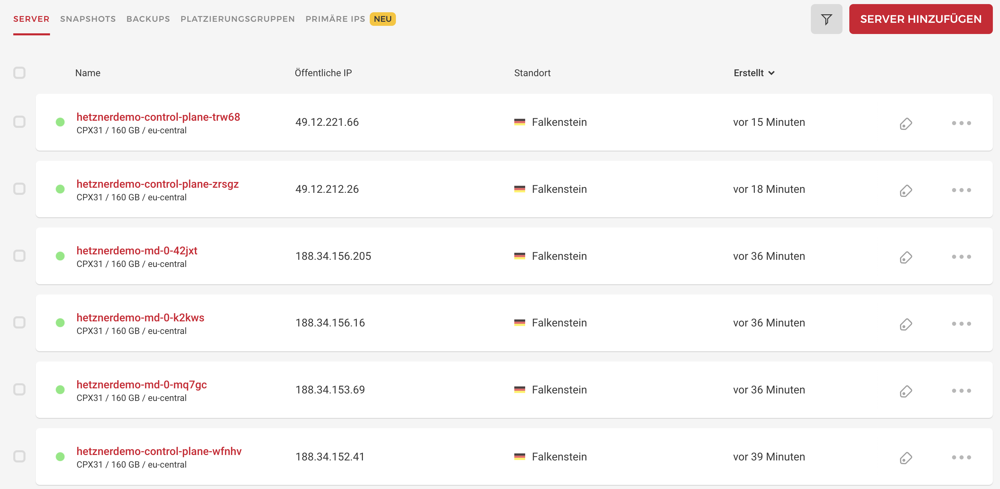
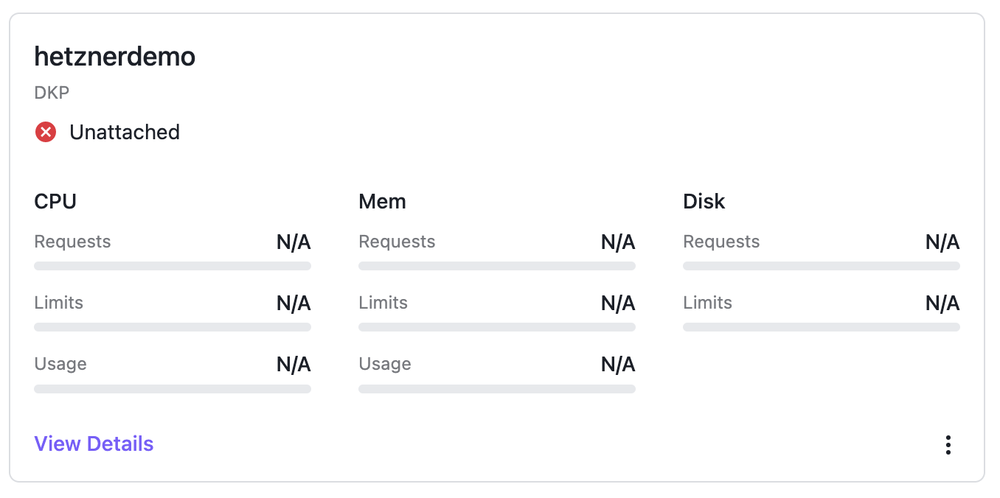
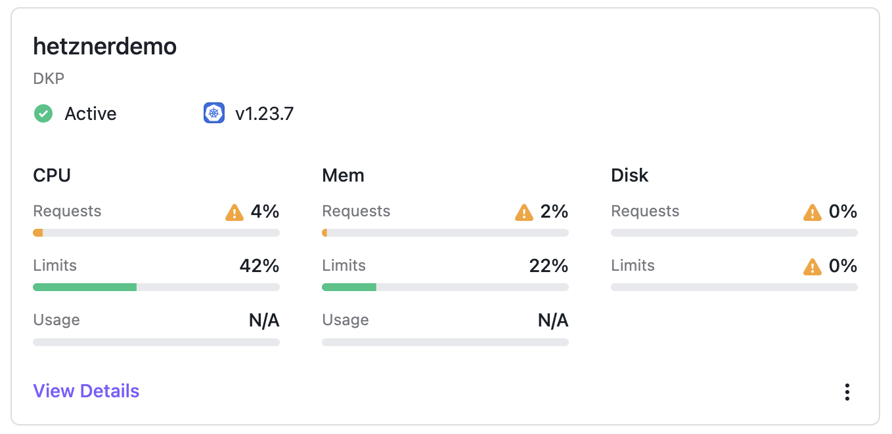

# Run DKP on Hetzner with Cluster API (CAPI)

The D2iQ Kubernetes Platform (DKP) makes your operational life easier. Instead of wasting time researching the CNCF landscape for the right tools to solve your enterprise requirements,  and struggling with the implementation and lifecycle, you can use a fully curated, integrated and supported Day 2 ready, out of the box platform.
The supported CAPI providers bring in an easy to use integrated under the hood infrastructure as code approach with the headache around the development and lifecycle of infrastructure as code automation. The product supports the following providers out of the box:
* AKS
* AWS
* Azure
* EKS
* GCP
* Preprovisioned (based on Ansible, requires SSH)
* VMware vSphere

Beside the pre integrated, supported providers you have the possibility to bring in any other CAPI provider. 
This blog post shows you the needed steps to run DKP on Hetzner Cloud by using the Hetzner CAPI provider.

## What is CAPI?

Kubernetes Cluster API (CAPI) is an official sub project from Kubernetes. The goal of CAPI is to provide a modular framework for deployment and lifecycle management of Kubernetes clusters. At a glance CAPI provides a declarative API and a toolset (for example clusterctl) to create and manage Kubernetes cluster as a Kubernetes object. 
A big benefit of CAPI is the large number of infrastructure providers (24+). This provider brings in all the required integrations for the infrastructure and handles the infrastructure as code lifecycle. The user did not need to think about infrastructure topics like how virtual machines are provisioned or how to create a nat gateway. Just define how many masters/workers, with flavor, with operating system and CAPI will deploy the cluster. 

## What is Hetzner?
Outside of Germany / DACH Hetzner is not very popular. Hetzner was founded 1997 in Germany and the portfolio is focused around colocation, bare metal server (as a service) and Hetzner Cloud. Hetzner Cloud provides a very easy to use self service offering around virtual machines (based on KVM), network, (block-) storage, and LoadBalancer. For automation approaches there are cli tools, Terraform modules and a CAPI provider available.
Since 2021 a datacenter in Ashburn, Virginia is also available to run workload in the United States of America.

## Prerequisites / Environment
To start with the deployment of your first cluster at Hetzner Cloud we need the following tools and informations:
* DKP command line tool (version 2.2+)
* Running DKP Enterprise (to attach the Hetzner cluster)
  * Create Workspace
* kubectl command line tool (see https://kubernetes.io/docs/tasks/tools/)
* helm command line tool (see https://helm.sh/docs/intro/install/)
* Clusterctl command line tool (see https://cluster-api.sigs.k8s.io/user/quick-start.html#install-clusterctl)
* Hetzner account
  * Create a project
  * Upload your SSH public key
  * Generate a readwrite API token for the project

We’ll use the generated API token for the cluster creation and lifecycle process. 

## Deploy Hetzner CAPI provider
Hetzner is not part of DKP's provided CAPI provider so need to deploy the CAPI provider to your centralized DKP Enterprise CAPI controller first. 
NOTE: It’s also possible to create a fresh local DKP bootstrap cluster and run the same steps there. If you run the steps on a local DKP bootstrap cluster you have to move the CAPI components to the deployed cluster later to make it “self managed”.

First, export the kubeconfig for our DKP Enterprise cluster where our CAPI controller is running:

````
$ export KUBECONFIG=./dkp.conf
````

We use the "clusterctl" command to generate the CAPI provider manifest for Hetzner and apply the generated capi manifest to our DKP Enterprise cluster:

````
$ clusterctl generate provider --infrastructure hetzner > hetzner-capi.yml

$ kubectl apply -f hetzner-capi.yml
namespace/cluster-api-provider-hetzner-system created
customresourcedefinition.apiextensions.k8s.io/hcloudmachines.infrastructure.cluster.x-k8s.io created
customresourcedefinition.apiextensions.k8s.io/hcloudmachinetemplates.infrastructure.cluster.x-k8s.io created
customresourcedefinition.apiextensions.k8s.io/hetznerbaremetalhosts.infrastructure.cluster.x-k8s.io created
customresourcedefinition.apiextensions.k8s.io/hetznerbaremetalmachines.infrastructure.cluster.x-k8s.io created
customresourcedefinition.apiextensions.k8s.io/hetznerbaremetalmachinetemplates.infrastructure.cluster.x-k8s.io created
customresourcedefinition.apiextensions.k8s.io/hetznerbaremetalremediations.infrastructure.cluster.x-k8s.io created
customresourcedefinition.apiextensions.k8s.io/hetznerbaremetalremediationtemplates.infrastructure.cluster.x-k8s.io created
customresourcedefinition.apiextensions.k8s.io/hetznerclusters.infrastructure.cluster.x-k8s.io created
customresourcedefinition.apiextensions.k8s.io/hetznerclustertemplates.infrastructure.cluster.x-k8s.io created
serviceaccount/caph-controller-manager created
role.rbac.authorization.k8s.io/caph-leader-election-role created
clusterrole.rbac.authorization.k8s.io/cluster-api-provider-hetzner-system-caph-manager-role created
clusterrole.rbac.authorization.k8s.io/cluster-api-provider-hetzner-system-caph-metrics-reader created
rolebinding.rbac.authorization.k8s.io/caph-leader-election-rolebinding created
clusterrolebinding.rbac.authorization.k8s.io/cluster-api-provider-hetzner-system-caph-manager-rolebinding created
configmap/caph-manager-config created
service/caph-webhook-service created
deployment.apps/caph-controller-manager created
certificate.cert-manager.io/caph-serving-cert created
issuer.cert-manager.io/caph-selfsigned-issuer created
mutatingwebhookconfiguration.admissionregistration.k8s.io/caph-mutating-webhook-configuration created
validatingwebhookconfiguration.admissionregistration.k8s.io/caph-validating-webhook-configuration created
````

Lets verify that your Hetzner CAPI provider is up and running:

````
$ kubectl get po -n cluster-api-provider-hetzner-system
NAME                                       READY   STATUS    RESTARTS   AGE
caph-controller-manager-7576dcbf56-wd9tc   1/1     Running   0          44s
````

All information around Hetzner CAPI provider can be found on the official github page: https://github.com/syself/cluster-api-provider-hetzner

## Deploy cluster
The Hetzner CAPI controller manager is up and running so we can deploy our first Hetzner based cluster. The first steps are exporting all required environment variables to configure the template.

````
$ export HCLOUD_TOKEN="<Hetzner rw api token>"
$ export HCLOUD_SSH_KEY="<SSH key name>"
$ export CLUSTER_NAME="hetznerdemo"
$ export HCLOUD_REGION="fsn1"
$ export CONTROL_PLANE_MACHINE_COUNT=3
$ export WORKER_MACHINE_COUNT=3
$ export KUBERNETES_VERSION=1.23.7
$ export HCLOUD_CONTROL_PLANE_MACHINE_TYPE=cpx31
$ export HCLOUD_WORKER_MACHINE_TYPE=cpx31
$ export CLUSTER_NAMESPACE=hetzner-7wrqw-5t2tp
````

Please be sure that all exported variables are valid. The “HCLOUD_SSH_KEY” name must match with the name you set during the upload via Hetzner cli / ui. The Kubernetes version must fit the supported K8s version range from DKP. 
See DKP release notes to validate which Kubernetes versions are supported.

These environment variables define that a cluster with 3 control-planes with “cpx31” flavor and 3 workers with “cpx31” flavor in region “fsn1” will be created. Your SSH key can be used to login as user “root”. 
A default Ubuntu 20.04 is used as a base image, but it is recommended to use your own base image if you run clusters in production!

The variable “CLUSTER_NAME” defines the namespace of the DKP workspace where the cluster should be created. Please note that workspace name and namespace name can be different. You can get both via the dkp cli:

````
$ dkp get workspace
NAME               	NAMESPACE                   
default-workspace  	kommander-default-workspace	
hetzner-7wrqw      	hetzner-7wrqw-5t2tp        	
kommander-workspace	kommander
````

CAPI credentials are stored as secret. The following commands generate a secret to store the HCLOUD_TOKEN in the defined namespace and set the “move” flag. This flag is needed if CAPI components needs to move from the bootstrap cluster to another cluster. This step is absolutely necessary if you run CAPI on local bootstrap cluster (via “dkp create bootstrap”).

````
$ kubectl create secret generic hcloud-token-${CLUSTER_NAME} \ 
    --from-literal=hcloud=${HCLOUD_TOKEN} -n ${CLUSTER_NAMESPACE} 
secret/hcloud-token-hetznerdemo created

$ kubectl label secret hcloud-token-${CLUSTER_NAME} \
    -n ${CLUSTER_NAMESPACE} \
    clusterctl.cluster.x-k8s.io/move=""
secret/hcloud-token-hetznerdemo patched
````

After all variables are set correctly and the Secret is created we can use “clusterctl” to create our cluster manifest.

````
$ clusterctl generate cluster --infrastructure hetzner:v1.0.0-beta.0 \
    ${CLUSTER_NAME} -n ${CLUSTER_NAMESPACE} > ${CLUSTER_NAME}.yaml
````

Befault Hetzner CAPI provider uses the same secret name “hetzner” for every cluster. This could be problematic if we want to deploy multiple clusters placed in different Hetzner projects in the same workspace. That’s why we used the secret name “hcloud-token-${CLUSTER_NAME}”.
Now we need to patch the generated cluster manifest to set the individual token secret name. 

````
$ cat ${CLUSTER_NAME}.yaml
...
---
apiVersion: infrastructure.cluster.x-k8s.io/v1beta1
kind: HetznerCluster
metadata:
  name: hetznerdemo
  namespace: hetzner-7wrqw-5t2tp
spec:
  controlPlaneEndpoint:
    host: ""
    port: 443
  controlPlaneLoadBalancer:
    region: fsn1
  controlPlaneRegions:
  - fsn1
  hcloudNetwork:
    enabled: false
  hcloudPlacementGroups:
  - name: control-plane
    type: spread
  - name: md-0
    type: spread
  hetznerSecretRef:
    key:
      hcloudToken: hcloud
    name: hetzner
  sshKeys:
    hcloud:
    - name: demo
---
````

Please replace the secret name “hetzner” with our cluster name secret “hcloud-token-${CLUSTER_NAME}”. In my case it looks like this:

````
$ echo hcloud-token-${CLUSTER_NAME}
hcloud-token-hetznerdemo

$ cat ${CLUSTER_NAME}.yaml
...
---
apiVersion: infrastructure.cluster.x-k8s.io/v1beta1
kind: HetznerCluster
metadata:
  name: hetznerdemo
  namespace: hetzner-7wrqw-5t2tp
spec:
  controlPlaneEndpoint:
    host: ""
    port: 443
  controlPlaneLoadBalancer:
    region: fsn1
  controlPlaneRegions:
  - fsn1
  hcloudNetwork:
    enabled: false
  hcloudPlacementGroups:
  - name: control-plane
    type: spread
  - name: md-0
    type: spread
  hetznerSecretRef:
    key:
      hcloudToken: hcloud
    name: hcloud-token-hetznerdemo
  sshKeys:
    hcloud:
    - name: demo
---
````

Now we can deploy the manifest.

````
$ kubectl apply -f ${CLUSTER_NAME}.yaml
kubeadmconfigtemplate.bootstrap.cluster.x-k8s.io/hetznerdemo-md-0 created
cluster.cluster.x-k8s.io/hetznerdemo created
machinedeployment.cluster.x-k8s.io/hetznerdemo-md-0 created
machinehealthcheck.cluster.x-k8s.io/hetznerdemo-control-plane-unhealthy-5m created
machinehealthcheck.cluster.x-k8s.io/hetznerdemo-md-0-unhealthy-5m created
kubeadmcontrolplane.controlplane.cluster.x-k8s.io/hetznerdemo-control-plane created
hcloudmachinetemplate.infrastructure.cluster.x-k8s.io/hetznerdemo-control-plane created
hcloudmachinetemplate.infrastructure.cluster.x-k8s.io/hetznerdemo-md-0 created
hetznercluster.infrastructure.cluster.x-k8s.io/hetznerdemo created
````

To see the current status we can describe the cluster via the dkp command line tool.

````
$ dkp describe cluster -n ${CLUSTER_NAMESPACE} -c ${CLUSTER_NAME}
NAME                                                                         READY  SEVERITY  REASON                           SINCE  MESSAGE                                                      
Cluster/hetznerdemo                                                          False  Warning   ScalingUp                        2m11s  Scaling up control plane to 3 replicas (actual 1)            
├─ClusterInfrastructure - HetznerCluster/hetznerdemo                                                                                                                                               
├─ControlPlane - KubeadmControlPlane/hetznerdemo-control-plane               False  Warning   ScalingUp                        2m11s  Scaling up control plane to 3 replicas (actual 1)            
│ └─Machine/hetznerdemo-control-plane-h5k5n                                  True                                              104s                                                                
│   └─MachineInfrastructure - HCloudMachine/hetznerdemo-control-plane-wfnhv                                                                                                                        
└─Workers                                                                                                                                                                                          
  └─MachineDeployment/hetznerdemo-md-0                                       False  Warning   WaitingForAvailableMachines      2m49s  Minimum availability requires 3 replicas, current 0 available
    ├─Machine/hetznerdemo-md-0-5d44f56679-52cgd                              False  Info      WaitingForInfrastructure         2m48s  0 of 2 completed                                             
    │ ├─BootstrapConfig - KubeadmConfig/hetznerdemo-md-0-nd56q               False  Info      WaitingForControlPlaneAvailable  2m21s                                                               
    │ └─MachineInfrastructure - HCloudMachine/hetznerdemo-md-0-mq7gc                                                                                                                               
    ├─Machine/hetznerdemo-md-0-5d44f56679-c4qbd                              False  Info      WaitingForInfrastructure         2m49s  0 of 2 completed                                             
    │ ├─BootstrapConfig - KubeadmConfig/hetznerdemo-md-0-z6btj               False  Info      WaitingForControlPlaneAvailable  2m21s                                                               
    │ └─MachineInfrastructure - HCloudMachine/hetznerdemo-md-0-42jxt                                                                                                                               
    └─Machine/hetznerdemo-md-0-5d44f56679-sgj75                              False  Info      WaitingForInfrastructure         2m48s  0 of 2 completed                                             
      ├─BootstrapConfig - KubeadmConfig/hetznerdemo-md-0-2wt8p               False  Info      WaitingForControlPlaneAvailable  2m21s  
````

After the first control plane node (in this example hetznerdemo-control-plane-h5k5n) is in ready state “true” we can get the kubeconfig of our new created cluster and deploy the needed components CNI, CCM and CSI (optional). 

The kubeconfig of the created cluster is stored as secret in the workspace namespace. We can use the kubectl command line tool to download the kubeconfig and save to our local filesystem.

````
$ kubectl get secret -n ${CLUSTER_NAMESPACE} ${CLUSTER_NAME}-kubeconfig \
    -o jsonpath='{.data.value}'|base64 -d> ${CLUSTER_NAME}.kubeconfig
````

We’ll use this kubeconfig file to communicate directly with the newly created cluster.

### Deploy CNI
Kubernetes needs a Container Network Interface (CNI) compliant software defined network to be ready for usage. DKP uses Calico by default but you can use any CNI compliant networking solution. Hetzner CAPI recommends Cilium so we will deploy Cilium via Helm.

````
$ helm repo add cilium https://helm.cilium.io/
"cilium" has been added to your repositories

$ KUBECONFIG=${CLUSTER_NAME}.kubeconfig helm upgrade \
    --install cilium cilium/cilium \
    --version 1.10.5 \
    --namespace kube-system \
    -f https://raw.githubusercontent.com/syself/cluster-api-provider-hetzner/main/templates/cilium/cilium.yaml

Release "cilium" does not exist. Installing it now.
NAME: cilium
LAST DEPLOYED: Mon Aug 29 14:10:32 2022
NAMESPACE: kube-system
STATUS: deployed
REVISION: 1
TEST SUITE: None
NOTES:
You have successfully installed Cilium with Hubble Relay and Hubble UI.

Your release version is 1.10.5.

For any further help, visit https://docs.cilium.io/en/v1.10/gettinghelp
````

In this example we’re using Helm to add the Cilium Helm chart repository and deploy the Cilium Helm chart to our newly created Kubernetes cluster.
Please be sure that your “helm upgrade” command uses the kubeconfig file of the target cluster. Otherwise you could damage your DKP Enterprise cluster.

Validate the running pods after the helm chart was successfully.

````
$ kubectl get po -n kube-system --kubeconfig ${CLUSTER_NAME}.kubeconfig |grep cilium
cilium-48qxj                            1/1     Running   0             3m
cilium-7rzd5                            1/1     Running   0             4m
cilium-cwpbp                            1/1     Running   0             4m
cilium-mq8h2                            1/1     Running   0             1m10s
cilium-n9ck2                            1/1     Running   0             4m
cilium-operator-c5fb547b4-fzpb8         1/1     Running   0             4m
cilium-operator-c5fb547b4-sszjq         1/1     Running   1 (3m ago)    4m
cilium-zrqt8                            1/1     Running   0             4m
````

### Deploy CCM
Hetzner Cloud requires a modified Cloud Controller Manager (CCM). The community provides a modified version of Kubernetes CCM for the Hetzner API. This Hetzner CCM is also available via Helm and will be deployed like the CNI solution.

````
$ helm repo add syself https://charts.syself.com
"syself" has been added to your repositories

$ KUBECONFIG=${CLUSTER_NAME}.kubeconfig helm upgrade --install ccm \   
    syself/ccm-hcloud \
    --version 1.0.10 \
    --namespace kube-system \
    --set secret.name=hcloud-token-${CLUSTER_NAME} \
    --set secret.tokenKeyName=hcloud \
    --set privateNetwork.enabled=false

Release "ccm" does not exist. Installing it now.
NAME: ccm
LAST DEPLOYED: Mon Aug 29 14:15:58 2022
NAMESPACE: kube-system
STATUS: deployed
REVISION: 1
TEST SUITE: None
````

Validate the running pods after the helm chart was successfully.

````
$ kubectl get po -n kube-system --kubeconfig ${CLUSTER_NAME}.kubeconfig |grep ccm
ccm-ccm-hcloud-85d598f8b7-zptfl          1/1     Running   1 (8m38s ago)   10m
````

### Deploy CSI (optional)
Hetzner provides a Container Storage Interface (CSI) for the block storage backend of Hetzner Cloud. If your application needs storage it makes sense to deploy the CSI plugin to easily consume block storage via Kubernetes StorageClass.

The deployment is also available via Helm chart. You need to create a overrides values yaml to define the StorageClass and inject this configuration during the “helm upgrade” process:

````
$ cat << EOF > csi-values.yaml
storageClasses:
- name: hcloud-volumes
  defaultStorageClass: true
  reclaimPolicy: Retain
EOF

$ KUBECONFIG=${CLUSTER_NAME}.kubeconfig helm upgrade --install \
    csi syself/csi-hcloud \
    --version 0.2.0 \
    --set secret.name=hcloud-token-${CLUSTER_NAME} \
    --set secret.tokenKeyName=hcloud \
    --namespace kube-system \
    -f csi-values.yaml

Release "csi" does not exist. Installing it now.
NAME: csi
LAST DEPLOYED: Mon Aug 29 14:20:33 2022
NAMESPACE: kube-system
STATUS: deployed
REVISION: 1
TEST SUITE: None
````

Validate if the StorageClass is created.

````
$ kubectl get sc --kubeconfig ${CLUSTER_NAME}.kubeconfig
NAME                       PROVISIONER         RECLAIMPOLICY   VOLUMEBINDINGMODE      ALLOWVOLUMEEXPANSION   AGE
hcloud-volumes (default)   csi.hetzner.cloud   Retain          WaitForFirstConsumer   true                    1m
````

## Verify cluster
After CSI and CCM are deployed correctly CAPI continues with the deployment of all master and worker nodes. After a few minutes our cluster should be deployed and all nodes are in state “Ready”. 
You can verify this via dkp and kubectl cli:

````
$ dkp describe cluster -n ${CLUSTER_NAMESPACE} -c ${CLUSTER_NAME}
NAME                                                                         READY  SEVERITY  REASON  SINCE  MESSAGE
Cluster/hetznerdemo                                                          True                     13m           
├─ClusterInfrastructure - HetznerCluster/hetznerdemo                                                                
├─ControlPlane - KubeadmControlPlane/hetznerdemo-control-plane               True                     13m           
│ ├─Machine/hetznerdemo-control-plane-dl8l7                                  True                     13m           
│ │ └─MachineInfrastructure - HCloudMachine/hetznerdemo-control-plane-trw68                                         
│ ├─Machine/hetznerdemo-control-plane-h5k5n                                  True                     36m           
│ │ └─MachineInfrastructure - HCloudMachine/hetznerdemo-control-plane-wfnhv                                         
│ └─Machine/hetznerdemo-control-plane-vq2lk                                  True                     16m           
│   └─MachineInfrastructure - HCloudMachine/hetznerdemo-control-plane-zrsgz                                         
└─Workers                                                                                                           
  └─MachineDeployment/hetznerdemo-md-0                                       True                     16m           
    ├─Machine/hetznerdemo-md-0-5d44f56679-52cgd                              True                     34m           
    │ └─MachineInfrastructure - HCloudMachine/hetznerdemo-md-0-mq7gc                                                
    ├─Machine/hetznerdemo-md-0-5d44f56679-c4qbd                              True                     34m           
    │ └─MachineInfrastructure - HCloudMachine/hetznerdemo-md-0-42jxt                                                
    └─Machine/hetznerdemo-md-0-5d44f56679-sgj75                              True                     34m           
      └─MachineInfrastructure - HCloudMachine/hetznerdemo-md-0-k2kws

$ kubectl get no -n kube-system --kubeconfig ${CLUSTER_NAME}.kubeconfig
NAME                              STATUS   ROLES                  AGE   VERSION
hetznerdemo-control-plane-trw68   Ready    control-plane,master   12m   v1.23.7
hetznerdemo-control-plane-wfnhv   Ready    control-plane,master   35m   v1.23.7
hetznerdemo-control-plane-zrsgz   Ready    control-plane,master   15m   v1.23.7
hetznerdemo-md-0-42jxt            Ready    <none>                 33m   v1.23.7
hetznerdemo-md-0-k2kws            Ready    <none>                 33m   v1.23.7
hetznerdemo-md-0-mq7gc            Ready    <none>                 33m   v1.23.7
````

You can also see all the resources via Hetzner UI (sorry, German account):


## Attach cluster to DKP Enterprise
At this stage CAPI successfully deployed the cluster and the CAPI controller running at the DKP Enterprise centralized cluster is handling the lifecycle. 

In DKP we see the cluster in state “unattached”:


That’s why the cluster object is created in the workspace so Kommander detects this cluster but it’s not managed by Kommander / DKP Enterprise right now. To change this we need to apply the missing KommanderCluster object. 

````
$ cat << EOF | kubectl apply -f -
apiVersion: kommander.mesosphere.io/v1beta1
kind: KommanderCluster
metadata:
  name: ${CLUSTER_NAME}
  namespace: ${CLUSTER_NAMESPACE}
spec:
  kubeconfigRef:
    name: ${CLUSTER_NAME}-kubeconfig
  clusterRef:
    capiCluster:
      name: ${CLUSTER_NAME}
EOF
kommandercluster.kommander.mesosphere.io/hetznerdemo created
````

This object tells Kommander / DKP Enterprise that the new cluster should be handled as an attached cluster. 
After a few seconds the cluster shows up as “Active” and DKP starts to deploy Flux and the workspace namespace to the target cluster. You can validate this via UI and cli:


````
$ kubectl get ns --kubeconfig ${CLUSTER_NAME}.kubeconfig
NAME                     STATUS   AGE
cert-manager             Active   61s
default                  Active   44m
hetzner-7wrqw-5t2tp      Active   71s
kommander-flux           Active   91s
kube-federation-system   Active   98s
kube-node-lease          Active   44m
kube-public              Active   44m
kube-system              Active   44m
````

All pre enabled applications from the Application Catalog (like Traefik) will be deployed to the target cluster now. 

## Get Traefik up and running
For Traefik we need to set an additional service label. Otherwise Kubernetes is not able to create the external LoadBalancer. 
Please set the following settings to our Traefik deployment (via DKP Enterprise UI or cli):

````
service:
  annotations: 
    load-balancer.hetzner.cloud/location: "<REGION>"
````

“REGION” must match with the REGION defined in environment variable “HCLOUD_REGION”

## Recap
DPK Enterprise is a powerful Kubernetes Distribution which is built on state of the art technologies like Kubernetes and Cluster API. We ship 7 CAPI providers out-of-the-box as part of the DKP product.
This guide showed how easy the integration of additional CAPI providers is. You have the possibility to implement additional CAPI providers to DKP, deploy clusters, and use the standardized toolset for Enterprise grade day 2 operation on all of your CAPI valid Kubernetes clusters.

The deployment of CAPI providers and clusters is declarative and based on YAML manifests, so it’s the perfect baseline to implement a GitOps approach. 
