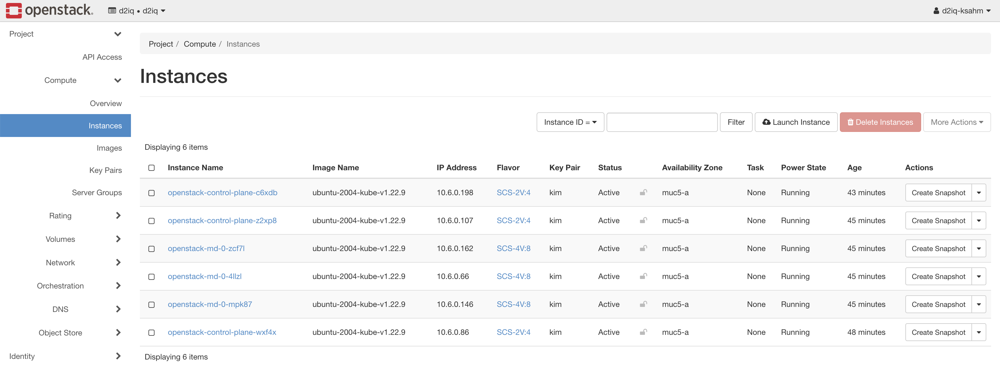
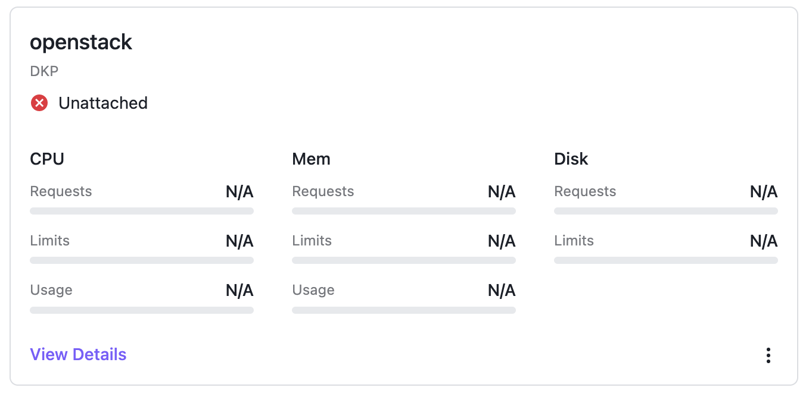
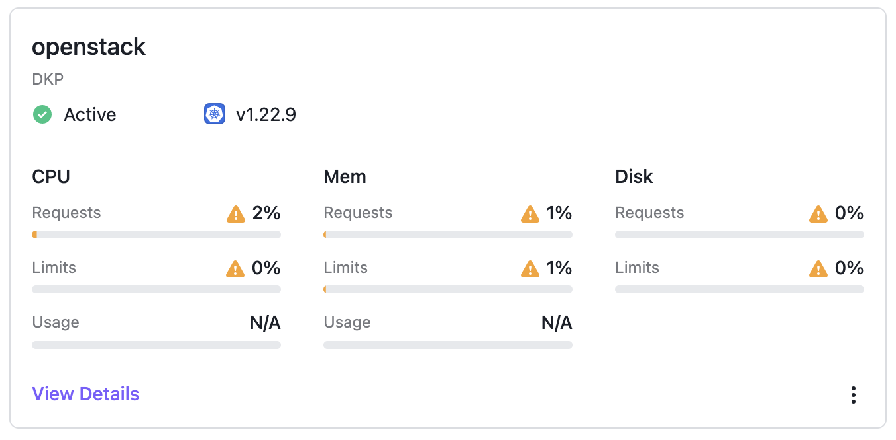

## What is DKP?

The D2iQ Kubernetes Platform (DKP) makes your operational life easier. Instead of wasting time researching the CNCF landscape for the right tools to solve your enterprise requirements, and struggling with the implementation and lifecycle, you can use a fully curated, integrated, and supported Day 2 ready, out-of-the-box platform.
DKP supported CAPI infrastructures provide an easy to use infrastructure-as-code approach that eliminates the headache around the complexity of the development and lifecycle challenges of Kubernetes. DKP supports the following infrastructure providers out of the box:

* [AKS][capz]
* [AWS][capa]
* [Azure][capz]
* [EKS][capa]
* [GCP][capg]
* Preprovisioned (based on Ansible, requires SSH)
* [VMware vSphere][capv]

For more information about the supported CAPI providers, please check out the official DKP documentation: [Advanced configuration][advanced configuration]

Beside the pre-integrated, supported providers, you can bring in any other CAPI provider.
This blog post shows you the needed steps to run DKP on OpenStack by using the OpenStack CAPI provider.

Please note that all additional CAPI providers, which are not part of DKP, are not supported by D2iQ.

## What is CAPI?

Kubernetes Cluster API (CAPI) is an official subproject from Kubernetes. The goal of CAPI is to provide a modular framework for deployment and lifecycle management of Kubernetes clusters. At a glance, CAPI provides a declarative API and a toolset (for example `clusterctl`) to create and manage Kubernetes clusters as a Kubernetes object.
A big benefit of CAPI is the large number of infrastructure providers (24+). This provider brings in all the required integrations for the infrastructure and handles the infrastructure as code lifecycle. The user does not need to think about infrastructure topics like how virtual machines are provisioned or how to create a NAT gateway. Just define how many control plane and worker nodes, with flavor, with operating system and CAPI will deploy the cluster.

For more information, see the [official CAPI documentation][CAPI docs]

## What is OpenStack?

OpenStack is an open source cloud infrastructure platform to mainly provide infrastrcture as a service (IaaS). The OpenStack project was started 2010 by NASA and Rackspace. In 2014, the OpenStack Foundation was founded and the ecosystem grows to an Anything as a Service (XaaS) platform. The foundation was renamed to "Open Infrastructure Foundation" in 2021.

The core components for an OpenStack based IaaS platform are:

* Cinder (Block storage)
* Glance (Image service)
* Horizon (UI)
* Keystone (Identity)
* Neutron (Network)
* Nova (Compute)

The OpenStack ecosystem contains 20+ more projects. Every project handles one "as a service" feature like DNSaaS, LBaaS, etc. The most used hypervisor is Linux KVM. OpenStack can be used to create public and private cloud platforms and it's a nice alternative to proprietary infrastructure solutions like VMware.

For more information, see the [official OpenStack website][openstack website]

## Prerequisites / Environment

To start with the deployment of your first cluster at OpenStack, you need the following tools and information:

* DKP command line tool (version 2.2+)
* Running DKP Enterprise (to attach the OpenStack cluster)
  * [Create Workspace][create workspace docs]
* [kubectl][kubectl] command line tool
* [helm][helm] command line tool
* [clusterctl][clusterctl] command line tool
* OpenStack account
  * Download your "OpenStack clouds.yaml file" (Login -> API Access -> Download OpenStack clouds.yaml file)
  * Upload your SSH public key
* An Ubuntu / Linux server to run KVM for image build

During this example you can use your personal credentials. For production deployments, it's recommended to create Application Credentials instead using personal credentials!
NOTE: The OpenStack CAPI provider requires OpenStack Octavia (LoadBalancer as a Service).

## Deploy OpenStack CAPI provider

OpenStack (CAPO) is not part of DKP's supported CAPI provider, so you need to deploy the CAPI provider to your DKP Enterprise management cluster first.

NOTE: It’s possible to create a fresh local DKP bootstrap cluster and run the same steps there. If you run the steps on a local DKP bootstrap cluster, you have to move the CAPI components to the deployed cluster later to make it `self managed`.

First, export the kubeconfig for our DKP Enterprise cluster where our CAPI controller is running:

```bash
export KUBECONFIG=./dkp.conf
```

The `clusterctl` command will be used to generate the CAPI provider manifest for OpenStack and apply the generated capi manifest to our DKP Enterprise cluster:

```bash
$ clusterctl generate provider --infrastructure openstack > openstack-capi.yml

$ kubectl apply -f openstack-capi.yml
namespace/capo-system created
customresourcedefinition.apiextensions.k8s.io/openstackclusters.infrastructure.cluster.x-k8s.io created
customresourcedefinition.apiextensions.k8s.io/openstackclustertemplates.infrastructure.cluster.x-k8s.io created
customresourcedefinition.apiextensions.k8s.io/openstackmachines.infrastructure.cluster.x-k8s.io created
customresourcedefinition.apiextensions.k8s.io/openstackmachinetemplates.infrastructure.cluster.x-k8s.io created
serviceaccount/capo-manager created
role.rbac.authorization.k8s.io/capo-leader-election-role created
clusterrole.rbac.authorization.k8s.io/capo-system-capo-manager-role created
rolebinding.rbac.authorization.k8s.io/capo-leader-election-rolebinding created
clusterrolebinding.rbac.authorization.k8s.io/capo-system-capo-manager-rolebinding created
service/capo-webhook-service created
deployment.apps/capo-controller-manager created
certificate.cert-manager.io/capo-serving-cert created
issuer.cert-manager.io/capo-selfsigned-issuer created
mutatingwebhookconfiguration.admissionregistration.k8s.io/capo-mutating-webhook-configuration created
validatingwebhookconfiguration.admissionregistration.k8s.io/capo-validating-webhook-configuration created
```

Lets verify that your Openstack CAPI provider is up and running:

```bash
$ kubectl get po -n capo-system
NAME                                       READY   STATUS    RESTARTS   AGE
capo-controller-manager-69bfb5c646-7jspb   1/1     Running   0          25s
```

All information around OpenStack CAPI provider can be found on the [official github page][capo]

## Generate base image

Virtual machines in OpenStack need a base image to start from. The base images for CAPO require already installed tooling like kubeadm, kubelet and container runtime. The OpenStack CAPI community provides an automation to easily build CAPI images for OpenStack.
To follow this process you need an Linux server (Ubuntu is recommended) to run the KVM based image build process.
For more information, see the [official capo documentation][capo docs].

Jump to your build server via SSH and install all the needed packages first:

```bash
sudo apt install -y qemu-kvm libvirt-daemon-system libvirt-clients virtinst cpu-checker libguestfs-tools libosinfo-bin python3-pip ansible make
```

After the installation of the required tools, you can clone the repo and run the preparation.
During this step all depenencies will be resolved.

```bash
git clone https://github.com/kubernetes-sigs/image-builder.git
cd image-builder/images/capi
make deps-qemu
```

The current version of the image-builder support base images for:

* CentOS 7
* Flatcar
* RedHat Enterprise Linux 8
* Rocky Linux 8
* Ubuntu 18.04
* Ubuntu 20.04

The following command starts the build process for an Ubuntu 20.04 CAPI base image:

```bash
make build-qemu-ubuntu-2004
```

During the run you see the image build process is using Packer and Ansible.
After 10-20 minutes the build should be done and the output tells you where the base image is located:

```plain
...
==> qemu: Downloading spec file and debug info
    qemu: Downloading Goss specs from, /tmp/goss-spec.yaml and /tmp/debug-goss-spec.yaml to current dir
==> qemu: Gracefully halting virtual machine...
==> qemu: Converting hard drive...
==> qemu: Running post-processor: custom-post-processor (type shell-local)
==> qemu (shell-local): Running local shell script: /tmp/packer-shell667395816
Build 'qemu' finished after 15 minutes 2 seconds.

==> Wait completed after 15 minutes 2 seconds

==> Builds finished. The artifacts of successful builds are:
--> qemu: VM files in directory: ./output/ubuntu-2004-kube-v1.22.9
--> qemu: VM files in directory: ./output/ubuntu-2004-kube-v1.22.9
```

The image is generated as a qcow2 file. We can upload this image directly to the OpenStack image store, but most OpenStack platforms recommend RAW images instead of qcow2 (performance boost during deployment, based on the storage integration).
You can use the command "qemu-img" to convert the qcow2 image to raw:

```bash
qemu-img convert \
  -f qcow2 \
  -O raw \
  ./output/ubuntu-2004-kube-v1.22.9/ubuntu-2004-kube-v1.22.9 \
  ./output/ubuntu-2004-kube-v1.22.9/ubuntu-2004-kube-v1.22.9.raw
```

After the successful conversion, you can upload your image to OpenStack via UI or CLI:

```bash
export OS_CLOUD=<name of the openstack cloud>
openstack image create --private --file ./output/ubuntu-2004-kube-v1.22.9/ubuntu-2004-kube-v1.22.9.raw ubuntu-2004-kube-v1.22.9
```

>> This step requires that your OpenStack `clouds.yaml` is placed at `/etc/openstack/clouds.yaml` or in your current directory.

### Different Kubernetes version

Currently, the image-builder default Kubernetes version is 1.22.9. If you need a newer Kubernetes version, you have to patch the packer config and replace the default version 1.22.9 with your preferred version. In this example, we build a CAPI image with Kubernetes version 1.23.7:

```bash
$ sed -i 's/1.22.9/1.23.7/g' packer/config/kubernetes.json
$ make build-qemu-ubuntu-2004
...
==> qemu: Downloading spec file and debug info
    qemu: Downloading Goss specs from, /tmp/goss-spec.yaml and /tmp/debug-goss-spec.yaml to current dir
==> qemu: Gracefully halting virtual machine...
==> qemu: Converting hard drive...
==> qemu: Running post-processor: custom-post-processor (type shell-local)
==> qemu (shell-local): Running local shell script: /tmp/packer-shell56890594
Build 'qemu' finished after 15 minutes 58 seconds.

==> Wait completed after 15 minutes 58 seconds

==> Builds finished. The artifacts of successful builds are:
--> qemu: VM files in directory: ./output/ubuntu-2004-kube-v1.23.7
--> qemu: VM files in directory: ./output/ubuntu-2004-kube-v1.23.7
```

After this, you have an additional CAPI image for OpenStack with Kubernetes v1.23.7. After conversion to RAW, you can upload it to OpenStack, too.

## Deploy cluster

The OpenStack CAPI controller manager is up and running, so the OpenStack based cluster can be deployed.
The first step is loading the `clouds.yaml` file into the environment. The community has created a helper script you can use to convert `clouds.yaml` to environment variables.

Be sure that your `clouds.yaml` has the minimum settings like this example:

```yaml
clouds:
  openstack:
    auth:
      auth_url: <OpenStack Keystone api url>
      username: "<OpenStack username>"
      project_id: <OpenStack project id>
      project_name: "<OpenStack project name>"
      user_domain_name: "<OpenStack domain name>"
      password: "<personal OpenStack password>"
    region_name: "<OpenStack Region>"
    interface: "public"
    identity_api_version: 3
```

Download the helper script and let it run:

```bash
wget https://raw.githubusercontent.com/kubernetes-sigs/cluster-api-provider-openstack/master/templates/env.rc -O /tmp/env.rc
source /tmp/env.rc <path/to/clouds.yaml> <cloud>
```

NOTE: If you running on MacOS you have to patch the /tmp/env.rc

```bash
sed -ie 's/--wrap=0//g' /tmp/env.rc
```

For example, in my environment, the source command looks like this:

```bash
source /tmp/env.rc /etc/openstack/clouds.yaml openstack
```

After this, we need to export additional required variables:

```bash
export OPENSTACK_DNS_NAMESERVERS=<dns nameservers>
export OPENSTACK_FAILURE_DOMAIN=<availability zone name>
export OPENSTACK_CONTROL_PLANE_MACHINE_FLAVOR=<flavor name>
export OPENSTACK_NODE_MACHINE_FLAVOR=<flavor name>
export OPENSTACK_SSH_KEY_NAME=<ssh key pair name>
export OPENSTACK_EXTERNAL_NETWORK_ID=<external network ID>
export CLUSTER_NAMESPACE=<workspace namespace name>
export CLUSTER_NAME=openstack
export CONTROL_PLANE_MACHINE_COUNT=3
export WORKER_MACHINE_COUNT=3
export KUBERNETES_VERSION=1.22.9
export OPENSTACK_IMAGE_NAME=ubuntu-2004-kube-v1.22.9
```

Please be sure that all exported variables are valid. The Kubernetes version must fit the supported K8s version range from DKP and `KUBERNETES_VERSION` must match the installed Kubernetes version of the used OpenStack image.

See DKP release notes to validate which Kubernetes versions are [supported][DKP release notes].

The variable `CLUSTER_NAMESPACE` defines the namespace of the DKP workspace where the cluster should be created. Please note that workspace name and namespace name can be different. You can get both via the DKP CLI:

```bash
$ dkp get workspace
NAME                  NAMESPACE
default-workspace     kommander-default-workspace
kommander-workspace   kommander
openstack-mc7nh-clgc6 openstack-mc7nh-clgc6
```

After all variables are set correctly, the `clusterctl` command can be used to create the OpenStack cluster manifest and apply it to DKP.

```bash
$ clusterctl generate cluster --infrastructure openstack:v0.6.3 ${CLUSTER_NAME} \
    -n ${CLUSTER_NAMESPACE} > ${CLUSTER_NAME}.yaml

$ kubectl apply -f ${CLUSTER_NAME}.yaml
cluster.cluster.x-k8s.io/openstack created
openstackcluster.infrastructure.cluster.x-k8s.io/openstack created
kubeadmcontrolplane.controlplane.cluster.x-k8s.io/openstack-control-plane created
openstackmachinetemplate.infrastructure.cluster.x-k8s.io/openstack-control-plane created
machinedeployment.cluster.x-k8s.io/openstack-md-0 created
openstackmachinetemplate.infrastructure.cluster.x-k8s.io/openstack-md-0 created
kubeadmconfigtemplate.bootstrap.cluster.x-k8s.io/openstack-md-0 created
secret/openstack-cloud-config created
```

You can describe the cluster's current status via the `dkp` command line tool.

```bash
$ dkp describe cluster -n ${CLUSTER_NAMESPACE} -c ${CLUSTER_NAME}
NAME                                                                          READY  SEVERITY  REASON                           SINCE  MESSAGE
Cluster/openstack                                                             False  Warning   ScalingUp                        57s    Scaling up control plane to 3 replicas (actual 1)
├─ClusterInfrastructure - OpenStackCluster/openstack
├─ControlPlane - KubeadmControlPlane/openstack-control-plane                  False  Warning   ScalingUp                        57s    Scaling up control plane to 3 replicas (actual 1)
│ └─Machine/openstack-control-plane-gd8nv                                     True                                              33s
│   └─MachineInfrastructure - OpenStackMachine/openstack-control-plane-wxf4x
└─Workers
  └─MachineDeployment/openstack-md-0                                          False  Warning   WaitingForAvailableMachines      4m10s  Minimum availability requires 3 replicas, current 0 available
    ├─Machine/openstack-md-0-b787658d6-74nt8                                  False  Info      WaitingForInfrastructure         4m10s  0 of 2 completed
    │ ├─BootstrapConfig - KubeadmConfig/openstack-md-0-576bf                  False  Info      WaitingForControlPlaneAvailable  84s
    │ └─MachineInfrastructure - OpenStackMachine/openstack-md-0-zcf7l
    ├─Machine/openstack-md-0-b787658d6-tj9zv                                  False  Info      WaitingForInfrastructure         4m10s  0 of 2 completed
    │ ├─BootstrapConfig - KubeadmConfig/openstack-md-0-2k8bz                  False  Info      WaitingForControlPlaneAvailable  84s
    │ └─MachineInfrastructure - OpenStackMachine/openstack-md-0-mpk87
    └─Machine/openstack-md-0-b787658d6-zrmmc                                  False  Info      WaitingForInfrastructure         4m10s  0 of 2 completed
      ├─BootstrapConfig - KubeadmConfig/openstack-md-0-s2l5k                  False  Info      WaitingForControlPlaneAvailable  84s
      └─MachineInfrastructure - OpenStackMachine/openstack-md-0-4llzl
```

After the first control plane node (in this example `openstack-control-plane-gd8nv`) is in ready state `true`, you can get the kubeconfig of our newly created cluster and deploy the needed CNI component.

The kubeconfig of the created cluster is stored as secret in the workspace namespace. You can use the kubectl command line tool to download the kubeconfig and save to our local filesystem.

```bash
kubectl get secret -n ${CLUSTER_NAMESPACE} ${CLUSTER_NAME}-kubeconfig \
  -o jsonpath='{.data.value}'|base64 -d> ${CLUSTER_NAME}.kubeconfig
```

You’ll use this kubeconfig file to communicate directly with the newly created cluster.

### Deploy CNI

Kubernetes needs a Container Network Interface (CNI) compliant software defined network to be ready for usage. DKP uses [Calico][calico] by default, so you'll deploy Calico to the new deployed cluster. Calico provides multiple deployment methods.
In this case, you're using Calico manifests:

```bash
$ kubectl apply --kubeconfig ${CLUSTER_NAME}.kubeconfig \
    -f https://docs.projectcalico.org/v3.21/manifests/calico.yaml
customresourcedefinition.apiextensions.k8s.io/bgpconfigurations.crd.projectcalico.org created
customresourcedefinition.apiextensions.k8s.io/bgppeers.crd.projectcalico.org created
customresourcedefinition.apiextensions.k8s.io/blockaffinities.crd.projectcalico.org created
customresourcedefinition.apiextensions.k8s.io/caliconodestatuses.crd.projectcalico.org created
customresourcedefinition.apiextensions.k8s.io/clusterinformations.crd.projectcalico.org created
customresourcedefinition.apiextensions.k8s.io/felixconfigurations.crd.projectcalico.org created
customresourcedefinition.apiextensions.k8s.io/globalnetworkpolicies.crd.projectcalico.org created
customresourcedefinition.apiextensions.k8s.io/globalnetworksets.crd.projectcalico.org created
customresourcedefinition.apiextensions.k8s.io/hostendpoints.crd.projectcalico.org created
customresourcedefinition.apiextensions.k8s.io/ipamblocks.crd.projectcalico.org created
customresourcedefinition.apiextensions.k8s.io/ipamconfigs.crd.projectcalico.org created
customresourcedefinition.apiextensions.k8s.io/ipamhandles.crd.projectcalico.org created
customresourcedefinition.apiextensions.k8s.io/ippools.crd.projectcalico.org created
customresourcedefinition.apiextensions.k8s.io/ipreservations.crd.projectcalico.org created
customresourcedefinition.apiextensions.k8s.io/kubecontrollersconfigurations.crd.projectcalico.org created
customresourcedefinition.apiextensions.k8s.io/networkpolicies.crd.projectcalico.org created
customresourcedefinition.apiextensions.k8s.io/networksets.crd.projectcalico.org created
clusterrole.rbac.authorization.k8s.io/calico-kube-controllers created
clusterrolebinding.rbac.authorization.k8s.io/calico-kube-controllers created
clusterrole.rbac.authorization.k8s.io/calico-node created
clusterrolebinding.rbac.authorization.k8s.io/calico-node created
daemonset.apps/calico-node created
serviceaccount/calico-node created
deployment.apps/calico-kube-controllers created
serviceaccount/calico-kube-controllers created
Warning: policy/v1beta1 PodDisruptionBudget is deprecated in v1.21+, unavailable in v1.25+; use policy/v1 PodDisruptionBudget
poddisruptionbudget.policy/calico-kube-controllers created
```

Please be sure that your `kubectl apply` command uses the kubeconfig file of the target cluster. Otherwise, you could damage your DKP Enterprise cluster.

Validate the running pods after the helm chart was successfully.

```bash
$ kubectl get po -A --kubeconfig ${CLUSTER_NAME}.kubeconfig |grep calico
kube-system   calico-kube-controllers-7f76d48f74-9pvpg                           1/1     Running   0               2m9s
kube-system   calico-node-7mqfw                                                  1/1     Running   0               2m10s
kube-system   calico-node-f65nv                                                  1/1     Running   0               2m10s
kube-system   calico-node-fkkth                                                  1/1     Running   0               2m10s
kube-system   calico-node-ps8hq                                                  1/1     Running   0               2m10s
kube-system   calico-node-tgrz4                                                  1/1     Running   0               2m10s
kube-system   calico-node-znmk5                                                  1/1     Running   0               2m10s
```

### Deploy CCM

Kubernetes requires an external cloud provider to communicate with the OpenStack API. The community provides a Cloud Controller Manager for the OpenStack API. This OpenStack CCM is also available via Helm and will be deployed like the CNI solution.

First we need to create a `openstack-ccm.yaml` with the required settings and deploy the Helm chart. You found all these settings in the `clouds.yaml` file.

```bash
$ cat <<EOF>openstack-ccm.yaml
cloudConfig:
  global:
    auth-url: <OpenStack Keystone api url>
    username: "<OpenStack username>"
    password: "<personal OpenStack password>"
    project-id: "<OpenStack project id>"
    project-name: "<OpenStack project name>"
    tenant-id: "<OpenStack project id>"
    tenant-name: "<OpenStack project name>"
    user-domain-name: "<OpenStack domain name>"
  loadBalancer:
    floating-network-id: "<external network id>"
    create-monitor: false
EOF

$ helm repo add cpo https://kubernetes.github.io/cloud-provider-openstack
"cpo" has been added to your repositories

$ helm upgrade --install openstack-ccm cpo/openstack-cloud-controller-manager \
    --values openstack-ccm.yaml \
    --kubeconfig ${CLUSTER_NAME}.kubeconfig \
    --namespace kube-system

NAME: openstack-ccm
LAST DEPLOYED: Wed Aug 31 12:14:37 2022
NAMESPACE: kube-system
STATUS: deployed
REVISION: 1
TEST SUITE: None
```

Validate the running pods after the helm chart was successfully updated.

```bash
$ kubectl get po -n kube-system --kubeconfig ${CLUSTER_NAME}.kubeconfig |grep openstack-cloud
openstack-cloud-controller-manager-bb2q5                1/1     Running   0             105s
openstack-cloud-controller-manager-dq7zm                1/1     Running   0             105s
openstack-cloud-controller-manager-lsvns                1/1     Running   0             105s
```

### Deploy CSI (optional)

OpenStack provides a Container Storage Interface (CSI) for the block storage backend (Cinder) and file storage backend (Manila). If your application needs storage it makes sense to deploy the CSI plugins to easily consume block storage and (if available in your OpenStack cloud) file storage via Kubernetes StorageClass.

The deployment is also available via Helm chart. The following example deploys the Cinder default configuration:

```bash
$ cat <<EOF> csi.yml
secret:
  enabled: true
  create: false
  name: cloud-config
storageClass:
  enabled: true
  custom: |-
    ---
    apiVersion: storage.k8s.io/v1
    kind: StorageClass
    metadata:
      name: rbd-fast
      annotations:
        storageclass.kubernetes.io/is-default-class: "true"
    provisioner: cinder.csi.openstack.org
    volumeBindingMode: WaitForFirstConsumer
    allowVolumeExpansion: true
    parameters:
      type: rbd_fast
EOF

$ helm upgrade --install cinder-csi cpo/openstack-cinder-csi \
    --kubeconfig ${CLUSTER_NAME}.kubeconfig \
    --namespace kube-system \
    -f csi.yml

NAME: cinder-csi
LAST DEPLOYED: Wed Aug 31 12:18:48 2022
NAMESPACE: kube-system
STATUS: deployed
REVISION: 1
TEST SUITE: None
NOTES:
Use the following storageClass csi-cinder-sc-retain and csi-cinder-sc-delete only for RWO volumes.
```

The secret is already created by the CCM, so there is no need to create a dedicated secret for CSI and you can reuse the existing secret from CCM.
Validate if the StorageClass is created.

```bash
$ kubectl get sc --kubeconfig ${CLUSTER_NAME}.kubeconfig
NAME                   PROVISIONER                RECLAIMPOLICY   VOLUMEBINDINGMODE   ALLOWVOLUMEEXPANSION   AGE
csi-cinder-sc-delete   cinder.csi.openstack.org   Delete          Immediate           true                   6s
csi-cinder-sc-retain   cinder.csi.openstack.org   Retain          Immediate           true                   6s
```

## Verify cluster

After CNI and CCM are deployed correctly, CAPI continues with the deployment of all control plane and worker nodes. After a few minutes, our cluster should be deployed and all nodes are in state `Ready`.
You can verify this via `dkp` and kubectl CLI:

```bash
$ dkp describe cluster -n ${CLUSTER_NAMESPACE} -c ${CLUSTER_NAME}
NAME                                                                          READY  SEVERITY  REASON  SINCE  MESSAGE
Cluster/openstack                                                             True                     40m
├─ClusterInfrastructure - OpenStackCluster/openstack
├─ControlPlane - KubeadmControlPlane/openstack-control-plane                  True                     40m
│ ├─Machine/openstack-control-plane-bspd4                                     True                     40m
│ │ └─MachineInfrastructure - OpenStackMachine/openstack-control-plane-c6xdb
│ ├─Machine/openstack-control-plane-gd8nv                                     True                     45m
│ │ └─MachineInfrastructure - OpenStackMachine/openstack-control-plane-wxf4x
│ └─Machine/openstack-control-plane-p84ps                                     True                     42m
│   └─MachineInfrastructure - OpenStackMachine/openstack-control-plane-z2xp8
└─Workers
  └─MachineDeployment/openstack-md-0                                          True                     33m
    ├─Machine/openstack-md-0-b787658d6-74nt8                                  True                     42m
    │ └─MachineInfrastructure - OpenStackMachine/openstack-md-0-zcf7l
    ├─Machine/openstack-md-0-b787658d6-tj9zv                                  True                     42m
    │ └─MachineInfrastructure - OpenStackMachine/openstack-md-0-mpk87
    └─Machine/openstack-md-0-b787658d6-zrmmc                                  True                     42m
      └─MachineInfrastructure - OpenStackMachine/openstack-md-0-4llzl

$ kubectl get no -n kube-system --kubeconfig ${CLUSTER_NAME}.kubeconfig
NAME                            STATUS   ROLES                  AGE   VERSION
openstack-control-plane-c6xdb   Ready    control-plane,master   41m   v1.22.9
openstack-control-plane-wxf4x   Ready    control-plane,master   44m   v1.22.9
openstack-control-plane-z2xp8   Ready    control-plane,master   43m   v1.22.9
openstack-md-0-4llzl            Ready    <none>                 43m   v1.22.9
openstack-md-0-mpk87            Ready    <none>                 43m   v1.22.9
openstack-md-0-zcf7l            Ready    <none>                 43m   v1.22.9
```

You can also see all the resources via OpenStack Horizon:


## Attach cluster to DKP Enterprise

At this stage, CAPI successfully deployed the cluster and the CAPI controller, running at the DKP Enterprise management cluster, is handling the lifecycle.

In DKP you see the cluster in state “unattached”:


The reason for this is because the cluster object is created in the workspace, so Kommander detects this cluster but it’s not managed by Kommander / DKP Enterprise right now.

To change this, you need to apply the missing KommanderCluster object:

```bash
$ cat << EOF | kubectl apply -f -
apiVersion: kommander.mesosphere.io/v1beta1
kind: KommanderCluster
metadata:
  name: ${CLUSTER_NAME}
  namespace: ${CLUSTER_NAMESPACE}
spec:
  kubeconfigRef:
    name: ${CLUSTER_NAME}-kubeconfig
  clusterRef:
    capiCluster:
      name: ${CLUSTER_NAME}
EOF
```

This object tells Kommander / DKP Enterprise that the new cluster should be handled as an attached cluster.
After a few seconds, the cluster shows up as `Active` and DKP starts to deploy Flux and the workspace namespace to the target cluster. You can validate this via UI and CLI:


```bash
$ kubectl get ns --kubeconfig ${CLUSTER_NAME}.kubeconfig
NAME                     STATUS   AGE
calico-apiserver         Active   92m
calico-system            Active   92m
cert-manager             Active   5m23s
default                  Active   94m
kommander-flux           Active   11m
kube-federation-system   Active   11m
kube-node-lease          Active   94m
kube-public              Active   94m
kube-system              Active   94m
openstack-mc7nh-clgc6    Active   10m
tigera-operator          Active   93m
```

All pre-enabled applications from the Application Catalog (like Traefik) will be deployed to the target cluster now.

## Recap

DKP Enterprise is a multi-cloud management platform which is built on state of the art technologies like Kubernetes and Cluster API. D2iQ ships 7 CAPI providers out-of-the-box as part of the DKP product.
This guide showed how easy the integration of additional CAPI providers is. You have the possibility to implement additional CAPI providers to DKP, deploy clusters, and use the standardized toolset for Enterprise-grade Day 2 operation on all of your CAPI valid Kubernetes clusters.

The deployment of CAPI providers and clusters is declarative and based on YAML manifests, so it’s the perfect baseline to implement a GitOps approach.

Thanks to our partner [Wavecon][wavecon] and [noris network][noris] for providing an account on their new OpenStack based public cloud [Wavestack][wavestack].

[CAPI docs]: https://cluster-api.sigs.k8s.io/
[openstack website]: https://www.openstack.org/
[create workspace docs]: https://docs.d2iq.com/dkp/2.3/workspaces#id-(2.3)Workspaces-CreateaWorkspace
[kubectl]: https://kubernetes.io/docs/tasks/tools/
[helm]: https://helm.sh/docs/intro/install/
[clusterctl]: https://cluster-api.sigs.k8s.io/user/quick-start.html#install-clusterctl
[calico]: https://www.tigera.io/project-calico/
[capa]: https://cluster-api-aws.sigs.k8s.io/
[capz]: https://capz.sigs.k8s.io/
[capg]: https://github.com/kubernetes-sigs/cluster-api-provider-gcp
[capv]: https://github.com/kubernetes-sigs/cluster-api-provider-vsphere
[advanced configuration]: https://docs.d2iq.com/dkp/2.3/advanced-configuration
[DKP release notes]: https://docs.d2iq.com/dkp/2.3/2-3-release-notes#id-(2.3)2.3.0ReleaseNotes-SupportedVersionssupported-versions
[capo]: https://github.com/kubernetes-sigs/cluster-api-provider-openstack
[capo docs]: https://image-builder.sigs.k8s.io/capi/providers/openstack.html
[wavecon]: https://wavecon.de/
[noris]: https://www.noris.de/
[wavestack]: https://www.noris.de/wavestack-cloud
