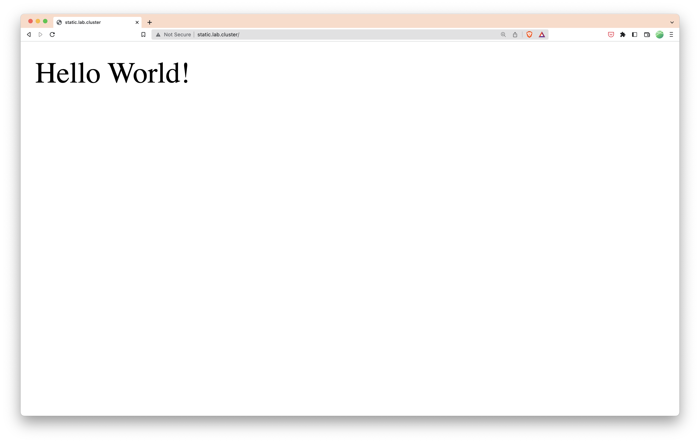
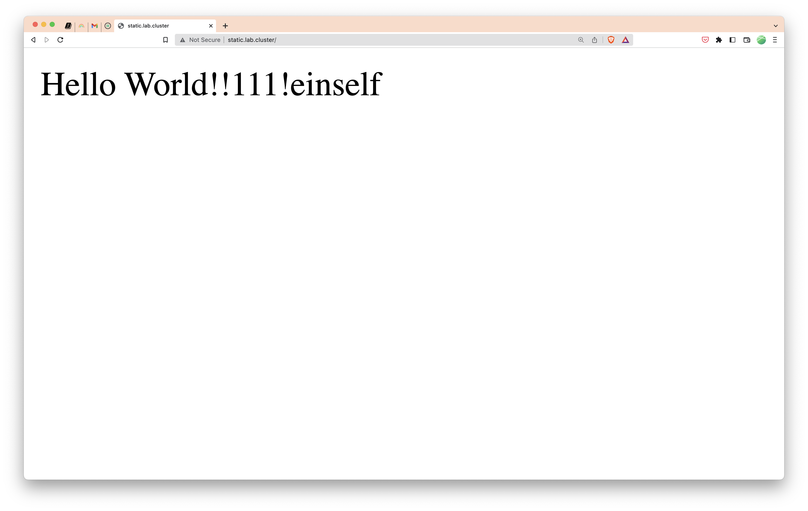

# Flux, from installation to automatically updating deployment in 30 minutes

## What are we doing?

In this article, we set up Flux on a Kubernetes cluster, deploy an application via Flux,
and then configure it to automatically update the used container image whenever there is a new version available.

We deploy this sample hello world website: https://github.com/mstruebing/static-sample
which is set up to automatically build and push a new docker image tagged as the current timestamp to DockerHub whenever there is a new commit.
Look into the [`index.html`](https://github.com/mstruebing/static-sample/blob/main/index.html), [`Dockerfile`](https://github.com/mstruebing/static-sample/blob/main/Dockerfile) and [`.github/workflows/ci.yaml`](https://github.com/mstruebing/static-sample/blob/main/.github/workflows/ci.yaml) files to get a sense of what the application is doing.

The full Flux repository can be found here: https://github.com/mstruebing/flux-demo where every step is a single commit.

## What is Flux and the advantages of GitOps

I could try to explain flux in depth here, but I will never be as good as the official documentation.
So I will keep it short and if you want to know more I recommend reading the following pages:

- [Flux components](https://fluxcd.io/flux/components/)
- [Flux from end to end](https://fluxcd.io/flux/flux-e2e/)

Let's explain a couple of terms first:

- Infrastructure as code (IaC): This is a way to describe your infrastructure in a declarative way with code.
- GitOps: A way to automatically update your infrastructure to match the definition of your infrastructure as code from a git repository

Now we can say that Flux is a GitOps solution for Kubernetes.
That means Flux manages to apply your IaC-defined infrastructure from a Git repository to your Kubernetes cluster in an automated way.

There are two different approaches to GitOps, push based and pull-based; we are using the pull-based approach.

Push-based means that the update is typically triggered by a CI/CD pipeline.
Pull-based means that there are running services which monitor your git repository (or for example image registry) and act on changes when they occur. These resources most likely are polled on a specified interval.

All of this has a couple of advantages:

- You can deploy fast, easily and often by simply pushing to a repository
- You can run a `git revert` if you messed up your environment and everything is like it was before
- This means you can easily roll back to every state of your application or infrastructure
- Not everyone needs access to the actual infrastructure environment, access to the git repository is enough to manage the infrastructure
- Self-documenting infrastructure: you do not need to ssh into a server and look around running services or explore all resources on a Kubernetes cluster
- Easy to create a demo environment by replicating the repository or creating a second deploy target

## Installing flux

We need a Kubernetes cluster up and running, the amount of nodes doesn't matter.
We need the Flux CLI installed on our local system you can have a look at how to install it here: https://fluxcd.io/flux/installation/

If you have installed the Flux CLI and have configured `kubectl` to be connected with the right cluster you can run `flux check --pre` to make sure your cluster is ready to get flux installed.

1. We need a personal access token for GitHub, which you can create here: https://github.com/settings/tokens.
   Generate a new token and check everything under repo.

2. Export your GitHub user name and your newly created token:

```sh
$ export GITHUB_USER="<YOUR_USERNAME>"
$  export GITHUB_TOKEN="<TOKEN>"
```

Tip: When you add a space in front of any shell command, this command is not available in your shell history.

3. Install flux with this command, I use `clusters/lab` here as my path because that's what my Kubernetes cluster is called and that way it's easier to set up this repository for multiple clusters.

```sh
flux bootstrap github \
 --owner=$GITHUB_USER \
 --repository=flux-demo \
 --path=clusters/lab \
 --personal
```

This installs flux on your cluster, creates the git repository in case it doesn't exist yet, adds a deploy key to the repository and pushes all the needed resources into the repository.

The output should look similar to this:

```
► connecting to github.com
► cloning branch "main" from Git repository "https://github.com/mstruebing/flux-demo.git"
✔ cloned repository
► generating component manifests
✔ generated component manifests
✔ committed sync manifests to "main" ("5aa79ce6bbce9fee2a6d3718e530680b7b92a525")
► pushing component manifests to "https://github.com/mstruebing/flux-demo.git"
► installing components in "flux-system" namespace
✔ installed components
✔ reconciled components
► determining if source secret "flux-system/flux-system" exists
► generating source secret
✔ public key: ecdsa-sha2-nistp384 AAAAE2VjZHNhLXNoYTItbmlzdHAzODQAAAAIbmlzdHAzODQAAABhBOZrGx5aRDH/WU5Mbz3+zwWFUkhdDWfaBiCrwuIkERSRhlYOyxS9Zvf8fm31OaemwdtOPdFx7IGtUxCFP5L9HtFtUUOO6DBmuECmNW21SXQHkLa7vOiPWqEOuk8Y9G8pqQ==
✔ configured deploy key "flux-system-main-flux-system-./clusters/lab" for "https://github.com/mstruebing/flux-demo"
► applying source secret "flux-system/flux-system"
✔ reconciled source secret
► generating sync manifests
✔ generated sync manifests
✔ committed sync manifests to "main" ("a20fd2de7c87ed86c0fb48caa1ba56ebf2ff4e77")
► pushing sync manifests to "https://github.com/mstruebing/flux-demo.git"
► applying sync manifests
✔ reconciled sync configuration
◎ waiting for Kustomization "flux-system/flux-system" to be reconciled
✔ Kustomization reconciled successfully
► confirming components are healthy
✔ helm-controller: deployment ready
✔ kustomize-controller: deployment ready
✔ notification-controller: deployment ready
✔ source-controller: deployment ready
✔ all components are healthy
```

Now, if we look into the newly created `flux-system` namespace we can see that
there are a couple of resources created:

```sh
$ kubectl get pods -n flux-system
NAME                                       READY   STATUS    RESTARTS   AGE
helm-controller-56fc8dd99d-rbnwc           1/1     Running   0          5m23s
notification-controller-644f548fb6-rzzgk   1/1     Running   0          5m23s
source-controller-7f66565fb8-xths9         1/1     Running   0          5m23s
kustomize-controller-bc455c688-4ctrv       1/1     Running   0          5m23s
```

These are needed and come with the default installation of flux, we will later add
other controllers too.

We also have a new resource type `gitrepositories.source.toolkit.fluxcd.io` where we can see
our repository:

```sh
$ kubectl get gitrepositories.source.toolkit.fluxcd.io -n flux-system
NAME          URL                                         AGE     READY   STATUS
flux-system   ssh://git@github.com/mstruebing/flux-demo   8m22s   True    stored artifact for revision 'main/a20fd2de7c87ed86c0fb48caa1ba56ebf2ff4e77'
```

And now we have successfully installed flux on our cluster.

## Deploying our sample application

To deploy our sample application we need to create a kustomization
to tell flux where to find our application definition in git.

First, start with cloning the repository flux created on our local machine.
We will execute the next steps from the root of the repository.

```sh
mkdir -p clusters/lab
flux create kustomization static-sample \
 --target-namespace=static-sample \
 --source=flux-system \
 --path="./clusters/lab/kustomize" \
 --prune=true \
 --interval=5m \
 --export > ./clusters/lab/static-kustomization.yaml
```

This will create the following kustomization:

```yaml
---
apiVersion: kustomize.toolkit.fluxcd.io/v1beta2
kind: Kustomization
metadata:
  name: static-sample
  namespace: flux-system
spec:
  interval: 5m0s
  path: ./clusters/lab/kustomize
  prune: true
  sourceRef:
    kind: GitRepository
    name: flux-system
  targetNamespace: static-sample
```

This means: hey, look, this is a kustomization which is called static-sample and lives
in our flux repository in the path `./clusters/lab/kustomize`, please check this every 5 minutes
and prune every resource which is no longer in the repository (`prune: true`).

Let's create this `kustomize` directory and add a namespace first before we add our other resources:

```sh
mkdir -p clusters/lab/kustomize
cat > clusters/lab/kustomize/namespace.yaml <<'EOF'
---
apiVersion: v1
kind: Namespace
metadata:
  name: static-sample
EOF
cat > clusters/lab/kustomize/kustomization.yaml <<'EOF'
apiVersion: kustomize.config.k8s.io/v1beta1
kind: Kustomization
resources:
  - namespace.yaml
EOF
```

If we now push these changes up, we should shortly see a namespace popping up on our
Kubernetes cluster. You can use `kubectl get ns --watch` until it's there.

```sh
$ kubectl get ns
NAME              STATUS   AGE
default           Active   316d
kube-system       Active   316d
kube-public       Active   316d
kube-node-lease   Active   316d
flux-system       Active   26m
static-sample     Active   15s
```

Now let's add all our other resources to make this application available on the cluster.

```sh
touch clusters/lab/kustomize/{deployment,service,ingress}.yaml
```

```sh
cat > clusters/lab/kustomize/deployment.yaml <<'EOF'
---
apiVersion: apps/v1
kind: Deployment
metadata:
  name: static-sample
  namespace: static-sample
spec:
  replicas: 1
  selector:
    matchLabels:
      app: static-sample
  template:
    metadata:
      labels:
        app: static-sample
    spec:
      containers:
        - image: mstruebing/static-sample:1666603774
          imagePullPolicy: IfNotPresent
          name: static-sample
EOF
cat > clusters/lab/kustomize/service.yaml <<'EOF'
---
apiVersion: v1
kind: Service
metadata:
  name: static-sample
  namespace: static-sample
spec:
  ports:
    - name: http
      port: 80
      protocol: TCP
      targetPort: 80
  selector:
    app: static-sample
EOF
cat > clusters/lab/kustomize/ingress.yaml <<'EOF'
---
apiVersion: networking.k8s.io/v1
kind: Ingress
metadata:
  name: static-sample
  namespace: static-sample
spec:
  rules:
    - host: static.lab.cluster
      http:
        paths:
          - backend:
              service:
                name: static-sample
                port:
                  name: http
            path: /
            pathType: Prefix
EOF
cat > clusters/lab/kustomize/kustomization.yaml <<'EOF'
---
apiVersion: kustomize.config.k8s.io/v1beta1
kind: Kustomization
resources:
  - namespace.yaml
  - deployment.yaml
  - service.yaml
  - ingress.yaml
EOF
```

As this cluster is running on my local network I will edit my `/etc/hosts` file
to map the IP address of the control plane node to the host I've added as the ingress rule.

If we now push this up and monitor our Kubernetes resources we should see these resources popping up on the cluster, you can monitor it with:

```sh
$ watch 'kubectl get pods,ingress,service,deployment -n static-sample'
```

When the resources are there the output should look similar to this:

```sh
$ kubectl get pods,ingress,service,deployment -n static-sample
NAME                                READY   STATUS    RESTARTS   AGE
pod/static-sample-9fb66bf4d-9ph2k   1/1     Running   0          107s

NAME                                      CLASS    HOSTS                ADDRESS                                                                                                                                                                                                             PORTS   AGE
ingress.networking.k8s.io/static-sample   <none>   static.lab.cluster   192.168.0.85,192.168.0.86,192.168.0.87,192.168.0.88,2a02:8108:483f:b989:3030:f80:38c4:197f,2a02:8108:483f:b989:34f9:beed:feb1:7fb,2a02:8108:483f:b989:db5b:2ada:2817:7e3c,2a02:8108:483f:b989:f5ea:87f6:69b0:4e0a   80      107s

NAME                    TYPE        CLUSTER-IP      EXTERNAL-IP   PORT(S)   AGE
service/static-sample   ClusterIP   10.43.219.195   <none>        80/TCP    107s

NAME                            READY   UP-TO-DATE   AVAILABLE   AGE
deployment.apps/static-sample   1/1     1            1           107s
```

When the resources are there we can go to http://static.lab.cluster/ and should see our website.



That's great, and whenever we push to our repository flux takes care of updating the resources on the cluster. Whenever we change the number of replicas, the image tag, or whatever, this will be automatically handled and we can add every Kubernetes resource needed there, we are not limited to what we did right now.

If you are following along, try to change the number of replicas and see what happens.

## Automatic image update

What we did works, but it has one disadvantage if we want full automation.
Whenever we change something in our application we manually need to update the image tag
on our deployment.

While this could be something you would want to do depending on your use case, I do not in this example.

In order to do this we need to install flux with some additional components: the image reflector and image automation controllers.

Let's uninstall flux and install it again with the needed components, don't worry, as we have everything
set up in our repository it is no effort to get into this state again.

```sh
$ flux uninstall --namespace=flux-system
$ flux bootstrap github \
  --components-extra=image-reflector-controller,image-automation-controller \
  --owner=mstruebing \
  --repository=flux-demo \
  --branch=main \
  --path=clusters/lab \
  --read-write-key \
  --personal
```

If we look at the pods running in our `flux-system`-namespace we can see the
controllers for our special components running:

```sh
$ kubectl get pods -n flux-system
NAME                                           READY   STATUS    RESTARTS   AGE
image-automation-controller-64dd99c7b6-rxsq8   1/1     Running   0          106s
source-controller-7f66565fb8-b5fnx             1/1     Running   0          106s
notification-controller-644f548fb6-66464       1/1     Running   0          106s
image-reflector-controller-7576c9cc77-ggjcs    1/1     Running   0          106s
helm-controller-56fc8dd99d-hbvfl               1/1     Running   0          106s
kustomize-controller-bc455c688-dwflv           1/1     Running   0          106s
```

We need to add an image repository which defines which repository to use for the image,
an image policy which defines which image tags to use and how to order them, and an image update automation which defines how we want to update our deployment.

Make sure to pull the repository first before following along as flux committed some
files to the repository with the latest flux installation.

```sh
flux create image repository static-sample \
--image=mstruebing/static-sample \
--namespace=static-sample \
--interval=1m \
--export > ./clusters/lab/static-sample-registry.yaml
```

```sh
flux create image policy static-sample \
--image-ref=static-sample \
--namespace=static-sample \
--select-semver=5.0.x \
--export > ./clusters/lab/static-sample-policy.yaml
```

We need to adjust the image policy to the following:

```sh
cat >clusters/lab/static-sample-policy.yaml <<'EOF'
---
apiVersion: image.toolkit.fluxcd.io/v1beta1
kind: ImagePolicy
metadata:
  name: static-sample
  namespace: static-sample
spec:
  imageRepositoryRef:
    name: static-sample
  filterTags:
    pattern: "^(?P<ts>.*)"
    extract: "$ts"
  policy:
    numerical:
      order: asc
EOF
```

This means that we want to extract the timestamp from the image and sort them ascending to always
have the newest image available. You can find a lot of other examples in the flux documentation: [https://fluxcd.io/docs/components/image/imagepolicies/#examples].

We need to tell our deployment that it should use the image from the freshly created `ImagePolicy`:

```sh
cat > clusters/lab/kustomize/deployment.yaml <<'EOF'
---
apiVersion: apps/v1
kind: Deployment
metadata:
  name: static-sample
  namespace: static-sample
spec:
  replicas: 1
  selector:
    matchLabels:
      app: static-sample
  template:
    metadata:
      labels:
        app: static-sample
    spec:
      containers:
        - image: mstruebing/static-sample:1666603774 # {"$imagepolicy": "static-sample:static-sample"}
          imagePullPolicy: IfNotPresent
          name: static-sample
EOF
```

We have updated the image to contain the comment `# {"$imagepolicy": "static-sample:static-sample"}` which needs to match the namespace and name of the `ImagePolicy`.

The last part is to create our image update automation with the following command:

```sh
flux create image update static-sample \
--namespace=static-sample \
--git-repo-namespace=flux-system \
--git-repo-ref=flux-system \
--git-repo-path="./clusters/lab" \
--checkout-branch=main \
--push-branch=main \
--author-name=fluxcdbot \
--author-email=fluxcdbot@users.noreply.github.com \
--commit-template="{{range .Updated.Images}}{{println .}}{{end}}" \
--export > ./clusters/lab/static-sample-automation.yaml
```

We need to manually edit the file as our source repository is in a different namespace:

```sh
cat > clusters/lab/static-sample-automation.yaml <<'EOF'
---
apiVersion: image.toolkit.fluxcd.io/v1beta1
kind: ImageUpdateAutomation
metadata:
  name: static-sample
  namespace: static-sample
spec:
  git:
    checkout:
      ref:
        branch: main
    commit:
      author:
        email: fluxcdbot@users.noreply.github.com
        name: fluxcdbot
      messageTemplate: "{{range .Updated.Images}}{{println .}}{{end}}"
    push:
      branch: main
  interval: 1m0s
  sourceRef:
    kind: GitRepository
    name: flux-system
    namespace: flux-system
  update:
    path: ./clusters/lab
    strategy: Setters
EOF
```

We updated the namespace of the `sourceRef` to contain the namespace.

We can now look at what flux figured out:

```sh
$ flux get images all -n static-sample
NAME                            LAST SCAN                       SUSPENDED       READY   MESSAGE
imagerepository/static-sample   2022-10-24T13:22:04+02:00       False           True    successful scan, found 16 tags

NAME                            LATEST IMAGE                            READY   MESSAGE
imagepolicy/static-sample       mstruebing/static-sample:1666603774     True    Latest image tag for 'mstruebing/static-sample' resolved to: 1666603774

NAME                                    LAST RUN                        SUSPENDED       READY     MESSAGE
imageupdateautomation/static-sample     2022-10-24T13:22:05+02:00       False           True      no updates made
```

We can see flux found some tags in the repository and we can see to which tag the latest version is resolved.

Now, let's push an update to our sample application and change the Hello World!

```sh
echo 'Hello World!!111!einself' > index.html && \
  git add . && \
  git commit -m 'add better hello world' && \
  git push origin main
```

We need to wait for the GitHub Action to build and push the image, we can monitor the flux updates in the meantime with:

```sh
watch flux get images all -n static-sample
```

When it will be ready you will see that the image tag changed, the amount of tags found and the last commit is changed.

If we now go back to our website we can see our changes there:



That's it, you can do a lot more with Flux and what I did may not be the optimal way of doing this.
But it works for me and I deploy some applications on a real Kubernetes cluster like this without issues.

The Flux documentation contains all of this information but it could be hard to find your way around
with no experience, so I decided to write that blog post and hopefully inspire some people to try it out.
