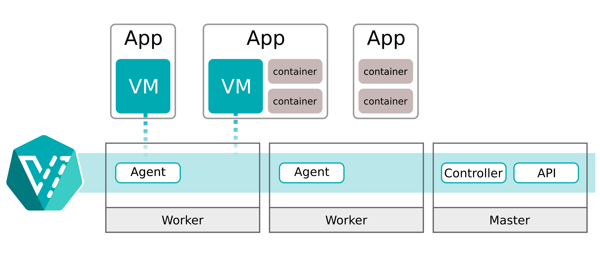

## Scope of KubeVirt Part 1

This is the first blog post of my "KubeVirt" series. The scope of this blog post is to understand what [KubeVirt] is and how Kubernetes can create and lifecycle "real" virtual machines via the native Linux Kernel virtualization feature [KVM].

The next parts of this series will be:
* KubeVirt Part 2 - How to create persistency by using software defined storage, provided by [Rook] [Ceph]
* KubeVirt Part 3 - How to leave the cluster internal network and use native VLANs
* KubeVirt Part 4 - Run DKP on top of KubeVirt by using the [Cluster API][capi] provider [CAPK][capk]

## What is KubeVirt?

The goal of the [KubeVirt] project is running and managing virtual machines (VMs) as Kubernetes workload. Important to understand is: KubeVirt is **NOT** a hypervisor. KubeVirt is a framework consisting of Kubernetes operators, custom resource definitions (CRDs) and APIs. Via CRDs, KubeVirt extend the Kubernetes API and gives the user the possibility to manage virtual machines as Kubernetes objects. 
The created virtual machines are created via [KVM] / [libvirt]

KubeVirt is part of the [CNCF] umbrella and currently an [Incubator] project.

## Why KubeVirt?

Some people asking "why (and when) do I need KubeVirt?". The official KubeVirt website describes the following use cases:

1. Leverage KubeVirt and Kubernetes to manage virtual machines for impractical-to-containerize apps.
2. Combine existing virtualized workloads with new container workloads on the one platform.
3. Support development of new microservice applications in containers that interact with existing virtualized applications.

What does it mean? There are some common use cases where KubeVirt can make your life easier:

### 1. Legacy workload

Kubernetes is not the answer for every workload. To run an application in Kubernetes sucessfully, the application needs to follow some principles. The common buzzword in this direction is [12 Factor App][12factorapp]. If the application is not build for Kubernetes and not compatible with the modern approach of software architecture and lifecycle, a legacy way of management is needed. 
Long story short: Classic hosting on virtual machines is needed. 

* **Option 1**: Run the virtual machine on a hypervisor, manage the VM in the old school way.
* **Option 2**: Run them via KubeVirt. At the end, it is a virtual machine. But it is managed like a Pod and orchestrated via Kubernetes. 

### 2. Infrastructure as a Service - the CNCF way

Kubernetes + KubeVirt + storage + network = Infrastructure as a Service

Yes, at the end it is not the easiest approach but with the right tools combined and integrated, Kubernetes can act as an Infrastructure as a Service platform.

What is Infrastructure as a Service ([IaaS])? 
The automated way to preserve compute, storage and network. 

But this is the topic of the next parts of this KubeVirt series. 

## KubeVirt basics and architecture

Already pointed out but learning is repeating: KubeVirt is **NOT** an hypervisor.
The virtual machines are created and managed via KVM / libvirt.
The virtual machines are **NOT** running inside a pod. All virtual machines are **real** KVM virtual machines running on the Linux nodes (and btw: that is how [OpenStack][openstack] works). 


> Image source: https://kubevirt.io/user-guide/assets/architecture-simple.png

The simple architecture shows the most important components:
* API: The KubeVirt api component runs as a `Deployment` in Kubernetes and is responsible for the communication with KubeVirt via webhooks, triggered via CRDs and the validation of the triggered objects.
* Controller: The KubeVirt controller is the heart of KubeVirt. The controller is responsible for the CRUD (lifecycle) operations of the KubeVirt objects running in Kubernetes. The controller continuously monitors all KubeVirt objects. 
* Agent: The KubeVirt agent (also known as `virt-handler`) is a `DaemonSet`, running on each Kubernetes worker, and it is the glue between Kubernetes and the underlaying Linux Kernel. The agent is responsible for keep the defined virtual machine (configuration) in sync with the running virtual machine on this node.

More detailed information to all compoents are available at the [KubeVirt Github page][kubevirt-components].


## Prerequisites / Environment

To start with the deployment of KubeVirt and the first virtual machine, following tools needs to be installed:

* DKP command line tool (version 2.4+)
* [kubectl][kubectl] command line tool
* Already deployed DKP Enterprise cluster
  * Deployment guidence for a DKP cluster can be found at the [D2iQ official documentation][advanced configuration]

> NOTE: this guide works with any Kubernetes distribution.

## Local installation of virtctl

KubeVirt ships its own CLI tool `virtctl` which is needed to communicate with the created virtual machines (like connecting to the virtual machine via console).
The binary is available for each common operating system and CPU architecture.

Install virtctl on macOS:
```bash
$ export RELEASE=v0.58.0

$ wget https://github.com/kubevirt/kubevirt/releases/download/${RELEASE}/virtctl-${RELEASE}-darwin-amd64
$ chmod +x virtctl-${RELEASE}-darwin-amd64
$ sudo mv virtctl-${RELEASE}-darwin-amd64 /usr/local/bin/virtctl
```

Install virtctl on Linux:
```bash
$ export RELEASE=v0.58.0

$ wget https://github.com/kubevirt/kubevirt/releases/download/${RELEASE}/virtctl-${RELEASE}-linux-amd64
$ chmod +x virtctl-${RELEASE}-linux-amd64
$ sudo mv virtctl-${RELEASE}-linux-amd64 /usr/local/bin/virtctl
```

## Deploy KubeVirt Operator
KubeVirt is available via Kubernetes manifests. This manifests contains all custom resource definitions (CRDs) as well as the KubeVirt Operator. 
The installation is as easy as possible:

```bash
$ export KUBECONFIG=<path/to/kubeconfig.file>
$ export RELEASE=v0.58.0

$ kubectl apply -f https://github.com/kubevirt/kubevirt/releases/download/${RELEASE}/kubevirt-operator.yaml
namespace/kubevirt created
customresourcedefinition.apiextensions.k8s.io/kubevirts.kubevirt.io created
priorityclass.scheduling.k8s.io/kubevirt-cluster-critical created
clusterrole.rbac.authorization.k8s.io/kubevirt.io:operator created
serviceaccount/kubevirt-operator created
role.rbac.authorization.k8s.io/kubevirt-operator created
rolebinding.rbac.authorization.k8s.io/kubevirt-operator-rolebinding created
clusterrole.rbac.authorization.k8s.io/kubevirt-operator created
clusterrolebinding.rbac.authorization.k8s.io/kubevirt-operator created
deployment.apps/virt-operator created

$ kubectl apply -f https://github.com/kubevirt/kubevirt/releases/download/${RELEASE}/kubevirt-cr.yaml
kubevirt.kubevirt.io/kubevirt created
```

Validate the KubeVirt deployment:
```bash
$ kubectl get po -n kubevirt
NAME                               READY   STATUS    RESTARTS   AGE
virt-api-7fb5d599cc-7zm4l          1/1     Running   0          75s
virt-api-7fb5d599cc-hcqx2          1/1     Running   0          75s
virt-controller-6d594d9b54-bcd7l   1/1     Running   0          52s
virt-controller-6d594d9b54-wvtnl   1/1     Running   0          52s
virt-handler-f4b9f                 1/1     Running   0          52s
virt-handler-fs8m7                 1/1     Running   0          52s
virt-handler-h6j2t                 1/1     Running   0          52s
virt-handler-lmzp8                 1/1     Running   0          52s
virt-handler-mknbf                 1/1     Running   0          52s
virt-operator-747d64c764-842d5     1/1     Running   0          2m4s
virt-operator-747d64c764-pwg5s     1/1     Running   0          2m4s
```

KubeVirt is up and running.

## Create the first virtual machine 

If all KubeVirt pods are started and in status `ready`, the first virtual machine can be created. 
In this example the operating system `Cirros` will be used. [Cirros] is a lightweight Linux operating system for testing only!

The following manifest describes a small virtual machine with Cirros as base image:
```bash
cat <<EOF > first-vm.yml
apiVersion: kubevirt.io/v1
kind: VirtualMachine
metadata:
  name: first-vm
spec:
  running: false
  template:
    metadata:
      labels:
        kubevirt.io/size: small
        kubevirt.io/domain: first-vm
    spec:
      domain:
        devices:
          disks:
            - name: containerdisk
              disk:
                bus: virtio
            - name: cloudinitdisk
              disk:
                bus: virtio
          interfaces:
          - name: default
            masquerade: {}
        resources:
          requests:
            memory: 64M
      networks:
      - name: default
        pod: {}
      volumes:
        - name: containerdisk
          containerDisk:
            image: quay.io/kubevirt/cirros-container-disk-demo
        - name: cloudinitdisk
          cloudInitNoCloud:
            userDataBase64: SGkuXG4=
EOF
```

Let's have a closer look on the different settings:

```
spec:
  running: false
```
* `running` defines the target power state after creating. `true` will trigger the start directly after the creating. with `false` the machine will not start after creating and must be started manually (or via automation).

```
      domain:
        devices:
          disks:
            - name: containerdisk
              disk:
                bus: virtio
            - name: cloudinitdisk
              disk:
                bus: virtio
          interfaces:
          - name: default
            masquerade: {}
        resources:
          requests:
            memory: 64M
```

* The `domain` section defined the hardware settings of the KVM virtual machine. This settings will be converted to the XML definition which is needed for libvirt.
* `disks` defines the hard disks of the virtual machines, like the `volumeMounts` section of a pod. 
* `interfaces` defines which with networks should be attached to the virtual machine. In this case the default CNI network (Calico for example) will be connected to the virtual machine. With this setting the virtual machine receives an IP address of the Pod network and can communicate with the Kubernetes pods and services directly.
* `resources` defines the memory settings for the virtual machine. This virtual machine get 64MB memory assigned.
* Because no CPU is set, the default value of `1` will be used.

```
      volumes:
        - name: containerdisk
          containerDisk:
            image: quay.io/kubevirt/cirros-container-disk-demo
        - name: cloudinitdisk
          cloudInitNoCloud:
            userDataBase64: SGkuXG4=
```
The `volumes` section defined the mapping for the disks, like `volumes` for pods. In this example, the volume `containerdisk` referres to the Cirros operating system image, which will be used as the boot volume. The volume `cloudinitdisk` contains the cloud-init metadata, which will be used to configure the operating system after the boot process (to configure network settings, user and password, etc).

More information about cloud-init and the available settings can be found a the [official documentation][cloudinit-docs].

The virtual machine manifest will be applied like a Kubernetes manifest (because it is one):
```bash
kubectl apply -f first-vm.yml 
virtualmachine.kubevirt.io/first-vm created
```

Check the state of the virtual machine:
```bash
$ kubectl get vm
NAME       AGE   STATUS    READY
first-vm   26s   Stopped   False
```

The virtual machine is created but stopped, because the manifest contains the setting `running: false`.

The virtual machine can be started by using the `virtctl` command:
```bash
$ virtctl start first-vm
VM first-vm was scheduled to start

$ kubectl get vm
NAME       AGE    STATUS    READY
first-vm   2m8s   Running   True
```

Now the virtual machine is running. 

## First functionality test

After the virtual machine is started, `virtctl console` can be used to access the virtual machines console.

Cirros provides the following user credentials per default:
* Username: cirros
* Password: gocubsgo

```bash
$ virtctl console first-vm
Successfully connected to first-vm console. The escape sequence is ^]

login as 'cirros' user. default password: 'gocubsgo'. use 'sudo' for root.
first-vm login: cirros
Password: 
```

After successful login we can run commands inside the virtual machine to check the vitual machine sizing, as well as the network connectivity:
```bash
$ cat /proc/cpuinfo 
processor	: 0
vendor_id	: GenuineIntel
cpu family	: 6
model		: 61
model name	: Intel Core Processor (Broadwell)
stepping	: 2
microcode	: 0x1
cpu MHz		: 2294.684
cache size	: 16384 KB
physical id	: 0
siblings	: 1
core id		: 0
cpu cores	: 1
apicid		: 0
initial apicid	: 0
fpu		: yes
fpu_exception	: yes
cpuid level	: 13
wp		: yes
flags		: fpu vme de pse tsc msr pae mce cx8 apic sep mtrr pge mca cmov pat pse36 clflush mmx fxsr sse sse2 ss syscall nx rdtscp lm constant_tsc rep_good nopl xtopology eagerfpu pni pclmulqdq vmx ssse3 fma cx16 pcid sse4_1 sse4_2 x2apic movbe popcnt tsc_deadline_timer aes xsave avx f16c rdrand hypervisor lahf_lm abm 3dnowprefetch tpr_shadow vnmi ept vpid fsgsbase tsc_adjust bmi1 hle avx2 smep bmi2 erms invpcid rtm rdseed adx smap xsaveopt arat
bugs		:
bogomips	: 4589.36
clflush size	: 64
cache_alignment	: 64
address sizes	: 46 bits physical, 48 bits virtual
power management:

$ free -m
             total         used         free       shared      buffers
Mem:            43           35            8            0            1
-/+ buffers:                 33            9
Swap:            0            0            0

$ df 
Filesystem           1K-blocks      Used Available Use% Mounted on
/dev                     18592         0     18592   0% /dev
/dev/vda1                30427     23522      5145  82% /
tmpfs                    22264         0     22264   0% /dev/shm
tmpfs                    22264        60     22204   0% /run

$ ip a
1: lo: <LOOPBACK,UP,LOWER_UP> mtu 65536 qdisc noqueue qlen 1
    link/loopback 00:00:00:00:00:00 brd 00:00:00:00:00:00
    inet 127.0.0.1/8 scope host lo
       valid_lft forever preferred_lft forever
    inet6 ::1/128 scope host 
       valid_lft forever preferred_lft forever
2: eth0: <BROADCAST,MULTICAST,UP,LOWER_UP> mtu 1500 qdisc pfifo_fast qlen 1000
    link/ether 52:54:00:a4:8f:ae brd ff:ff:ff:ff:ff:ff
    inet 10.0.2.2/24 brd 10.0.2.255 scope global eth0
       valid_lft forever preferred_lft forever
    inet6 fe80::5054:ff:fea4:8fae/64 scope link 
       valid_lft forever preferred_lft forever

$ ip route
default via 10.0.2.1 dev eth0 
10.0.2.0/24 dev eth0  src 10.0.2.2 

$ cat /etc/resolv.conf 
search default.svc.cluster.local
nameserver 10.96.0.10

$ curl google.com
<HTML><HEAD><meta http-equiv="content-type" content="text/html;charset=utf-8">
<TITLE>301 Moved</TITLE></HEAD><BODY>
<H1>301 Moved</H1>
The document has moved
<A HREF="http://www.google.com/">here</A>.
</BODY></HTML>

$ curl https://kubernetes -k
{
  "kind": "Status",
  "apiVersion": "v1",
  "metadata": {},
  "status": "Failure",
  "message": "forbidden: User \"system:anonymous\" cannot get path \"/\"",
  "reason": "Forbidden",
  "details": {},
  "code": 403
}
```

Again, all commands are executed via `virtctl console` at the virtual machine directly. The output shows that it is a real virtual machine. 
There is no information about the underlaying Linux node visible. The visible resources are limited. 

The interface `eth0` is connected to the CNI overlay network and received an IP address of the pod network.
Internet connectivitiy is working out of the box, the masquerading and routing is handled by the Kubernetes CNI.
Kubernetes internal CoreDNS server resolves all DNS requests, the virtual machine can talk with Kubernetes services (in this example the Kubernetes API curl).

## Access the VM via SSH

Managing virtual machines by using `virtctl console` is nice for debugging and troubleshooting but not a real solution for daily business. 
Normaly SSH is the standard to jump on a virtual machine. 

**Challenge**: The virtual machine is connected to our pod network, like a pod.

**Solution**: How to access a pod? By using a service which is exposed to the outside world via type `NodePort` or `LoadBalancer`. Our virtual machine acts like a pod, so we can create a service for SSH and expose it as service type `NodePort` or `LoadBalancer`.

```bash
$ cat <<EOF > first-vm-svc.yml
apiVersion: v1
kind: Service
metadata:
  name: first-vm-svc
spec:
  ports:
  - port: 22
    targetPort: 22
    protocol: TCP
  selector:
    kubevirt.io/domain: first-vm
  type: NodePort
EOF

$ kubectl apply -f first-vm-svc.yml
service/first-vm-svc created

$ kubectl get svc 
NAME           TYPE        CLUSTER-IP      EXTERNAL-IP   PORT(S)        AGE
first-vm-svc   NodePort    10.96.149.117   <none>        22:32537/TCP   5s
kubernetes     ClusterIP   10.96.0.1       <none>        443/TCP        167m
```

In this example, a service with type `NodePort` will be created and open the port 32537/TCP on each Kubernetes worker node.
To access the virtual machine, any Kubernetes worker node IP or hostname plus the shown node port can be used:

```bash
$ ssh <ip.of.my.workernode> -p 32537 -l cirros
The authenticity of host '[172.16.0.31]:32537 ([172.16.0.31]:32537)' can't be established.
ECDSA key fingerprint is SHA256:Xs3ZcDzPGpkVSdxB3gF+2+VdOYMze1a/w3DLoJfeyuM.
This key is not known by any other names
Are you sure you want to continue connecting (yes/no/[fingerprint])? yes
Warning: Permanently added '[172.16.0.31]:32537' (ECDSA) to the list of known hosts.
cirros@172.16.0.31's password: 
$ cat /etc/issue 
login as 'cirros' user. default password: 'gocubsgo'. use 'sudo' for root.
```

That's easy. Now the virtual machine can be managed like every other Linux host. 

## Run an Ubuntu virtual machine

Already pointed out: Cirros is a testing image, not build for operation. The following manifest creates an Ubuntu virtual machine with 2 CPUs, 8GB memory and an SSH service to access the machine. 

But an Ubuntu image has no preconfigured password. So we need to create a cloud-init configuration with SSH public key and (optional) preconfigured password. Create a file with this content:

```
#cloud-config
users:
  - default
  - name: kim
    passwd: "$6$kW4vfBM9kGgq4hr$TFtHW7.3jOECR9UCBuw9NrdSMJETzSVoNQGcVv2y.RqRUzWDEtYhYRkGvIpB6ml1fh/fZEVIgKbSXI9L1B6xF."
    shell: /bin/bash
    lock-passwd: false
    ssh_pwauth: True
    chpasswd: { expire: False }
    sudo: ALL=(ALL) NOPASSWD:ALL
    groups: users, admin
    ssh_authorized_keys:
     - <my ssh public key>
```

This cloud-init configuration creates a new user `kim` with the password `possible` and inject all the ssh **public** (!) keys defined at `ssh_authorized_keys`.

After the file is created, generate a base64 string and export it as variable called `CLOUDINIT`:
```bash
$ export CLOUDINIT=$(base64 -i ./<cloudinit-filename>)
```

Create the manifest for virtual machine as well as service and apply it:
```bash
$ cat <<EOF > ubuntu-vm.yml
---
apiVersion: kubevirt.io/v1
kind: VirtualMachine
metadata:
  name: ubuntu-vm
spec:
  running: true
  template:
    metadata:
      labels:
        kubevirt.io/size: small
        kubevirt.io/domain: ubuntu-vm
    spec:
      domain:
        cpu:
          cores: 2
        devices:
          disks:
            - name: containerdisk
              disk:
                bus: virtio
            - name: cloudinitdisk
              disk:
                bus: virtio
          interfaces:
          - name: default
            masquerade: {}
        resources:
          requests:
            memory: 8192Mi
      networks:
      - name: default
        pod: {}
      volumes:
        - name: containerdisk
          containerDisk:
            image: tedezed/ubuntu-container-disk:22.0
        - name: cloudinitdisk
          cloudInitNoCloud:
            userDataBase64: ${CLOUDINIT}
---
apiVersion: v1
kind: Service
metadata:
  name: ubuntu-vm-svc
spec:
  ports:
  - port: 22
    targetPort: 22
    protocol: TCP
  selector:
    kubevirt.io/domain: ubuntu-vm
  type: NodePort
EOF

$ kubectl apply -f ubuntu-vm.yml
virtualmachine.kubevirt.io/ubuntu-vm created
service/ubuntu-vm-svc created

$ kubectl get svc ubuntu-vm-svc
NAME            TYPE       CLUSTER-IP     EXTERNAL-IP   PORT(S)        AGE
ubuntu-vm-svc   NodePort   10.104.3.114   <none>        22:31467/TCP   36s

$ kubectl get vms
NAME                                  AGE     STATUS    READY
first-vm                              164m    Running   True
ubuntu-vm                             3m9s    Running   True
```

The spec of the virtual machine definition containts `running: true`, so the virtual machine is starting direct after the creation.
It could take a few minutes until the Ubuntu image is successful pulled and started. 

Now the machine should be accessable via SSH by using the created `NodePort` with the SSH key:
```bash
$ ssh <ip.of.my.workernode> -p 31467 -l kim
The authenticity of host '[172.16.0.31]:31467 ([172.16.0.31]:31467)' can't be established.
ED25519 key fingerprint is SHA256:ZulhgdraXTGV0bcq2Wj2MuY6rkE2JwV+3hEbzyN8cbk.
This key is not known by any other names
Are you sure you want to continue connecting (yes/no/[fingerprint])? yes
Warning: Permanently added '[172.16.0.31]:31467' (ED25519) to the list of known hosts.
Welcome to Ubuntu Kinetic Kudu (development branch) (GNU/Linux 5.19.0-15-generic x86_64)

 * Documentation:  https://help.ubuntu.com
 * Management:     https://landscape.canonical.com
 * Support:        https://ubuntu.com/advantage

  System information as of Thu Jan  5 14:10:02 UTC 2023

  System load:  0.046875          Processes:               121
  Usage of /:   44.5% of 3.21GB   Users logged in:         0
  Memory usage: 2%                IPv4 address for enp1s0: 10.0.2.2
  Swap usage:   0%

0 updates can be applied immediately.


The list of available updates is more than a week old.
To check for new updates run: sudo apt update


The programs included with the Ubuntu system are free software;
the exact distribution terms for each program are described in the
individual files in /usr/share/doc/*/copyright.

Ubuntu comes with ABSOLUTELY NO WARRANTY, to the extent permitted by
applicable law.

To run a command as administrator (user "root"), use "sudo <command>".
See "man sudo_root" for details.

kim@ubuntu-vm:~$ cat /etc/issue
Ubuntu Kinetic Kudu (development branch) \n \l

kim@ubuntu-vm:~$ free -h
               total        used        free      shared  buff/cache   available
Mem:           7.8Gi       154Mi       7.4Gi       0.0Ki       221Mi       7.4Gi
Swap:             0B          0B          0B

kim@ubuntu-vm:~$ cat /proc/cpuinfo 
processor	: 0
vendor_id	: GenuineIntel
cpu family	: 6
model		: 26
model name	: Intel Core i7 9xx (Nehalem Core i7, IBRS update)
stepping	: 3
microcode	: 0x1
cpu MHz		: 2261.008
cache size	: 16384 KB
physical id	: 0
siblings	: 2
core id		: 0
cpu cores	: 2
apicid		: 0
initial apicid	: 0
fpu		: yes
fpu_exception	: yes
cpuid level	: 11
wp		: yes
flags		: fpu vme de pse tsc msr pae mce cx8 apic sep mtrr pge mca cmov pat pse36 clflush mmx fxsr sse sse2 ht syscall nx rdtscp lm constant_tsc rep_good nopl xtopology cpuid tsc_known_freq pni vmx ssse3 cx16 sse4_1 sse4_2 x2apic popcnt tsc_deadline_timer hypervisor lahf_lm cpuid_fault pti ssbd ibrs ibpb stibp tpr_shadow vnmi flexpriority ept vpid tsc_adjust arat umip arch_capabilities
vmx flags	: vnmi preemption_timer invvpid ept_x_only ept_1gb flexpriority tsc_offset vtpr mtf vapic ept vpid
bugs		: cpu_meltdown spectre_v1 spectre_v2 spec_store_bypass l1tf mds swapgs
bogomips	: 4522.01
clflush size	: 64
cache_alignment	: 64
address sizes	: 40 bits physical, 48 bits virtual
power management:

processor	: 1
vendor_id	: GenuineIntel
cpu family	: 6
model		: 26
model name	: Intel Core i7 9xx (Nehalem Core i7, IBRS update)
stepping	: 3
microcode	: 0x1
cpu MHz		: 2261.008
cache size	: 16384 KB
physical id	: 0
siblings	: 2
core id		: 1
cpu cores	: 2
apicid		: 1
initial apicid	: 1
fpu		: yes
fpu_exception	: yes
cpuid level	: 11
wp		: yes
flags		: fpu vme de pse tsc msr pae mce cx8 apic sep mtrr pge mca cmov pat pse36 clflush mmx fxsr sse sse2 ht syscall nx rdtscp lm constant_tsc rep_good nopl xtopology cpuid tsc_known_freq pni vmx ssse3 cx16 sse4_1 sse4_2 x2apic popcnt tsc_deadline_timer hypervisor lahf_lm cpuid_fault pti ssbd ibrs ibpb stibp tpr_shadow vnmi flexpriority ept vpid tsc_adjust arat umip arch_capabilities
vmx flags	: vnmi preemption_timer invvpid ept_x_only ept_1gb flexpriority tsc_offset vtpr mtf vapic ept vpid
bugs		: cpu_meltdown spectre_v1 spectre_v2 spec_store_bypass l1tf mds swapgs
bogomips	: 4522.01
clflush size	: 64
cache_alignment	: 64
address sizes	: 40 bits physical, 48 bits virtual
power management:

kim@ubuntu-vm:~$ ip a
1: lo: <LOOPBACK,UP,LOWER_UP> mtu 65536 qdisc noqueue state UNKNOWN group default qlen 1000
    link/loopback 00:00:00:00:00:00 brd 00:00:00:00:00:00
    inet 127.0.0.1/8 scope host lo
       valid_lft forever preferred_lft forever
    inet6 ::1/128 scope host 
       valid_lft forever preferred_lft forever
2: enp1s0: <BROADCAST,MULTICAST,UP,LOWER_UP> mtu 1480 qdisc pfifo_fast state UP group default qlen 1000
    link/ether 52:54:00:41:11:d1 brd ff:ff:ff:ff:ff:ff
    inet 10.0.2.2/24 metric 100 brd 10.0.2.255 scope global dynamic enp1s0
       valid_lft 86313284sec preferred_lft 86313284sec
    inet6 fe80::5054:ff:fe41:11d1/64 scope link 
       valid_lft forever preferred_lft forever

kim@ubuntu-vm:~$ exit
logout
Connection to 172.16.0.31 closed.
```

Now a real virtual machine with an enterprise Linux distribution was created.

## Shutdown instance

Instances can be stopped via `virtctl stop <vm-name>`.

If you want to delete a virtual machine, delete the `vms` object: `kubectl delete vms <vm-name>`

That`s all.

## Troubleshoot 

Each technology is nice if it is working fine. But sometimes strange situations will happen. How to debug KubeVirt?

1. Be sure that all KubeVirt components are up and running: `kubectl get po -n kubevirt`
2. Check the logs of the KubeVirt components
3. Check the virt-launcher output:

Each virtual machine has a "helper" pod (called `virt-launcher`) running in the same namespace:
```bash
$ kubectl get po 
NAME                                                      READY   STATUS    RESTARTS   AGE
virt-launcher-first-vm-j5zbx                              2/2     Running   0          169m
virt-launcher-ubuntu-vm-ljjvb                             2/2     Running   0          12m
```

The `virt-launcher` pod has multiple stages and tasks:
* `container-disk-binary` and `volumecontainerdisk-init` prepare the disk image. The examples, used in this blog post, are using docker images as source which contains the base images for Cirros or Ubuntu. The init pods extract the qcow2 file `disk.img` and prepare it, so libvirt is able to use it. Other sources can be isos or qcow2 images downloaded directly by the init pods from HTTP sources or fileshares. 
* `volumecontainerdisk` copies the disk image to the right directory.
* `compute`, the main container, controls the virtual machine via libvirt. This container can be used to run `virsh` commands again libvirt:

```bash
$ kubectl exec -ti virt-launcher-ubuntu-vm-ljjvb -- bash
bash-4.4# virsh list
Authorization not available. Check if polkit service is running or see debug message for more information.
 Id   Name                State
-----------------------------------
 1    default_ubuntu-vm   running

bash-4.4# virsh dumpxml default_ubuntu-vm
Authorization not available. Check if polkit service is running or see debug message for more information.
<domain type='kvm' id='1'>
  <name>default_ubuntu-vm</name>
  <uuid>785ed614-3f22-561c-9981-87dd05ca90c4</uuid>
  <metadata>
    <kubevirt xmlns="http://kubevirt.io">
      <uid>e5f45977-58d0-45a3-97c5-0d8053183c60</uid>
      <graceperiod>
        <deletionGracePeriodSeconds>30</deletionGracePeriodSeconds>
      </graceperiod>
    </kubevirt>
  </metadata>
  <memory unit='KiB'>8388608</memory>
  <currentMemory unit='KiB'>8388608</currentMemory>
  <vcpu placement='static'>2</vcpu>
  <iothreads>1</iothreads>
......
```

The libvirt commandline tool `virsh` can be used to see what's happened under the hood and could be help during vm troublehooting. 

> Note: each `virt-launcher` pod is able to see the own virtual machine only! 


## Recap

KubeVirt is a good solution to run virtual machines in a Kubernetes ecosystem. The virtual machines are fully under the control of Kubernetes, but running as KVM virtual machine in the Kernel of the underlaying Linux node. 
Per default the virtual machines are connected to the Kubernetes pod network. This enables the user to run mixed applications based on containerized Kubernetes workload and virtual machine based workloads in the same network. 

The next Kubevirt blog post will cover the topic "persistence".


[KVM]: https://www.linux-kvm.org/page/Main_Page
[KubeVirt]: https://kubevirt.io/
[Rook]: https://rook.io
[Ceph]: https://ceph.io/
[CNCF]: https://cncf.io
[Incubator]: https://landscape.cncf.io/card-mode?project=incubating
[libvirt]: https://libvirt.org/
[12factorapp]: https://12factor.net/
[IaaS]: https://en.wikipedia.org/wiki/Infrastructure_as_a_service
[kubevirt-components]: https://github.com/kubevirt/kubevirt/blob/main/docs/components.md
[kubectl]: https://kubernetes.io/docs/tasks/tools/
[advanced configuration]: https://docs.d2iq.com/dkp/2.4/advanced-configuration
[capi]: https://cluster-api.sigs.k8s.io/
[capk]: https://github.com/kubernetes-sigs/cluster-api-provider-kubevirt
[capa]: https://cluster-api-aws.sigs.k8s.io/
[capz]: https://capz.sigs.k8s.io/
[capg]: https://github.com/kubernetes-sigs/cluster-api-provider-gcp
[capv]: https://github.com/kubernetes-sigs/cluster-api-provider-vsphere
[openstack]: https://www.openstack.org
[Cirros]: https://github.com/cirros-dev/cirros
[cloudinit-docs]: https://cloudinit.readthedocs.io/en/latest/