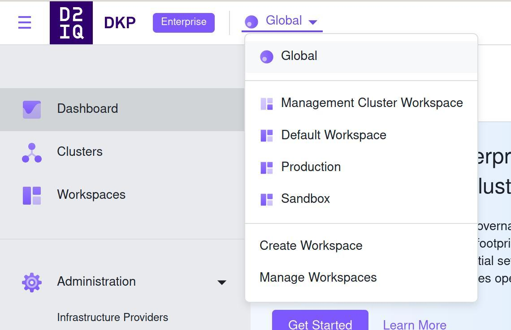

## Intro

When handling multiple environments, two common concerns are the isolation among them and their similarity. Cloud native environments provide us with multiple forms of isolation and different organizations have different ways of handling that. You can have just a bunch of new containers, a new instance, a new VPC, a new account in your cloud provider, etc.

With Kubernetes it’s no different. We can create a new deployment, a new namespace, a new service and ingress, etc. [Cluster API](https://cluster-api.sigs.k8s.io/) and especially [DKP Essential](https://d2iq.com/products/essential) makes it easy to manage a cluster lifecycle and enables us with a new level of easy isolation: new clusters!

Now the second point comes to the spotlight, the similarity between them. The common configuration, monitoring and control access to name a few. Whoever already deployed a production-like Kubernetes cluster knows that the task doesn’t finish when the nodes are registered, it probably just started. [DKP Enterprise](https://d2iq.com/products/enterprise) attacks exactly (but not exclusively) this point and in this post we are going to talk you through a demo that’s very similar to how we use it to elegantly provide multiple environments to D2iQ engineers.

We will focus on the deployment of our management cluster and control access. Further blog posts will detail more steps, like monitoring, Gitops, extending DKP Enterprise capabilities, and more. Let us know what topics you want to hear more about.

## The problem

The concept of multiple environments is most probably common knowledge to anyone who worked with modern software development. Even the simplest applications are born with a pre-production and production environment. Practices like Continuous Deployment and [deployment pipelines](https://martinfowler.com/bliki/DeploymentPipeline.html) are every day more common as they prove to be beneficial in multiple scenarios. A development environment in the cloud, instead of just in your local development machine can also come pretty handy. Some features are easier tested in real cloud environments, with load balancing, more processing power, among others.

Kubernetes adapts well to a huge variety of workloads: IoT, SaaS, eCommerces, Machine learning and data science, etc. Sometimes we need to demonstrate different capabilities, therefore it is really important that our sales engineers and solutions architects can also create their own clusters in their own cloud accounts. Furthermore, to each of these environments we need to make sure access control is updated, new engineers have access as soon as possible and those who no longer need access also have their access removed.

## The solution

As I mentioned before, DKP Enterprise is the key to manage multiple environments and multi clusters elegantly. It will manage access control, monitoring, deployments, etc. DKP Enterprise, itself, is deployed in a DKP cluster. From there, it federates all other clusters and controls the environments. Therefore let’s start creating our management cluster.

## Prerequisites

#### Cloud provider

This blogpost assumes you will be running on AWS, but you can check our documentation and easily translate it to your preferred cloud. To follow along you will need the DKP binary. You can get it by contacting our [sales representatives](mailto:sales@d2iq.com). Remember to ask them also for a DKP enterprise license as we will need that to create some workspaces.

Once you have the `dkp` command installed, make sure your cloud access is also configured. There are multiple ways of achieving this, for this tutorial check [these prerequisites](https://docs.d2iq.com/dkp/konvoy/2.2/choose-infrastructure/aws/quick-start-aws/#prerequisites). As you can see we will also need [docker](https://docs.docker.com/get-docker/) and [kubectl](https://kubernetes.io/docs/tasks/tools/#kubectl). Also, we will use [clusterawsadm](https://github.com/kubernetes-sigs/cluster-api-provider-aws/releases/latest), that’s not explicitly required, but will help.

We are going to create a few files during this blog post. I will try to explain in detail how to get there, but to make it easier, you can clone this [github repository](https://github.com/jonathanbeber/KommanderDemo). It has all the final versions of the files we are going to apply.

#### Custom domain

We will use a custom domain name for our cluster. That’s not required, of course, but it’s desirable unless you want to always remember a long URL or IP address your cloud provider gives for load balancers. DNS exists, thankfully, for a great reason. That’s said, there are two options to manage the DNS records for DKP: manually or automatically. DKP Enterprise supports [external-dns](https://github.com/kubernetes-sigs/external-dns), what’s a great solution for the latter, but for that to work, the external-dns’ pods running in your nodes will need permissions to change the DNS zone you choose. There are various ways to give this permission to the service, check the [tutorials](https://github.com/kubernetes-sigs/external-dns/blob/master/docs/tutorials) page in their repo. For simplicity reasons, we are going to give permission to the nodes themselves in this tutorial. That’s **not** indicated for production environments, see this [warning message](https://github.com/kubernetes-sigs/external-dns/blob/14a66037981f8e664371930acd659b29ac86848c/docs/tutorials/aws.md#ec2-instance-role-not-recommended). These permissions will also be useful to allow the [cert-manager](https://github.com/cert-manager/cert-manager) to create DNS records. Same warning applies for the cert-manager, ideally we should be using something like [IAM roles for service accounts](https://docs.aws.amazon.com/eks/latest/userguide/iam-roles-for-service-accounts.html) or [kube2iam](https://github.com/jtblin/kube2iam).

For this demo, we will create a new CloudFormation stack responsible for creating the policy to allow the nodes to change the DNS resources in AWS. Change the `extra-dns-policies.yaml` file and swap the `ZONE_ID` string for your [DNS hosted zone](https://docs.aws.amazon.com/Route53/latest/DeveloperGuide/ListInfoOnHostedZone.html). After changing that, you can apply that with:

```shell
$ aws cloudformation create-stack --stack-name demo-dns-manager --template-body file://extra-dns-policies.yaml --capabilities CAPABILITY_NAMED_IAM

```

#### IAM policies

We also need the required [IAM policies](https://docs.d2iq.com/dkp/konvoy/2.2/choose-infrastructure/aws/iam-policies/). We use the [`clusterawsadm`](https://github.com/kubernetes-sigs/cluster-api-provider-aws/releases/latest) approach to deploy it. First we get the default configuration with `clusterawsadm bootstrap iam print-config`. There is just one thing that we want to change there, and it’s to apply the policy we just created so that nodes can manage DNS. Open the file `iam-config.yaml` and under the `nodes` section change `ACCOUNT_ID to the value of your AWS account id:

```yaml
extraPolicyAttachments:
- arn:aws:iam::ACCOUNT_ID:policy/demo-dns-manager
```

Now we can apply that with:

```shell
$ clusterawsadm bootstrap iam create-cloudformation-stack --config ./iam-config.yaml

```
#### OIDC

For SSO we will use [dex](https://dexidp.io/) with an [OIDC connector](https://docs.d2iq.com/dkp/kommander/2.2/security/oidc). OIDC is supported by the biggest SSO players in the market. For this we will need a client ID and secret. You will also need to add the redirect URI in your SSO provider. Configure it to be “[https://management.YOUR_DOMAIN/dex/callback](https://management.YOUR_DOMAIN/dex/callback)” substituting `YOUR_DOMAIN` by the domain you are using for this demo. For example, in our case we are using the domain demo.d2iq.cloud, therefore our redirect URL is “[https://management.demo.d2iq.cloud/dex/callback](https://management.demo.d2iq.cloud/dex/callback)”. Make sure you have a client ID, secret and the issuer URL.

That’s all the prerequisites, let’s jump into creating our management cluster.


## Create a Cluster

Now let’s create our management cluster. In this demo we are going to focus on the DKP Enterprise capabilities, therefore, let’s do the simplest possible. DKP Essential accepts different cloud providers and a bunch of customization options, check the [documentation](https://docs.d2iq.com/dkp/konvoy/2.2/intro-dkp/) for more details. To create a basic cluster on AWS run:


```shell
$ dkp create cluster aws --cluster-name=management --additional-tags=owner=jbeber --additional-tags=expiration=3d --self-managed

```

This command will create a cluster for us on AWS (self managed, do not confuse it with EKS). The arguments are pretty much self-explanatory, but it’s interesting to note the `--self-managed` one. It requires DKP Essential to install the [Cluster API](https://cluster-api.sigs.k8s.io/) components in the cluster, so that it will manage itself. Any further upgrade, change, resize of the cluster is made by changing custom resources in the cluster itself!

This command will create a file called `management.conf` in your current directory. `management` in this case is the name of our cluster, as provided in the previous command. Let’s export it as our `KUBECONFIG` environment variable for this session:

```shell
$ export KUBECONFIG=management.conf

```

Remember that you will need to rerun this command every time you create a new terminal session. Later we will set up SSO and add ourselves as administrators so that we don’t need to do that every time. This file gives administration access to your cluster, do not commit it in git repositories and keep it safe!

We have to wait for the cluster to be ready, you can check it’s ready by running:

```shell
$ kubectl wait --for=condition=controlplaneready "clusters/management" --timeout=60m
```

It may take some time for the infrastructure to be in place. It creates a brand new VPC, all the nodes, load balancers, etc. It starts provisioning and managing the cluster from a `kind` instance in your local machine. Later on, it moves all these actions to itself.

#### DKP Enterprise installation

With our management cluster in place it’s time to deploy DKP Enterprise. This time we will want to explore more options, therefore, you can generate an installation configuration file with `dkp install kommander --init`, but for this demo it’s already available in the git repository with the name `kommander-install.yaml`. Now open this file. It will list all the applications that will be installed and some custom configuration for some of them.

If you analyze the output of the previous command you will notice that `external-dns` is not installed by default. Under the apps we added its configuration and you should be able to see it in the repo. You have to change the `YOUR_DOMAIN` string to the domain you will be using. In our case we will use demo.d2iq.cloud, therefore the configuration looks like:

```yaml
 external-dns:
   values: |
     aws:
       preferCNAME: true
       evaluateTargetHealth: true
     policy: upsert-only
     txtPrefix: _externaldns-
     txtOwnerId: kommander
     domainFilters:
     - demo.d2iq.cloud
     logFormat: json
     metrics:
       enabled: true
```

We also changed the main `kommander` application to allow the users to see the AWS credentials it uses to maintain itself. It will later allow us to launch new clusters in the same account.

SSO is an important feature to any tool. Kubernetes is no different. Therefore, let’s configure [dex](https://dexidp.io/). It will allow new and existing users of your organization to access Kubernetes clusters, workspaces and their resources. We need to change, in the `dex` section, the following:

* `OIDC_ISSUER_URL`: that’s the URL provided by your SSO platform;
* `OIDC_CLIENT_ID`: the client ID for the application you created in your SSO platform;
* `OIDC_CLIENT_SECRET`: the client secret for the very same application; and
* `YOUR_DOMAIN`: the same value you used above for external-dns.

Note that `redirectURI` will be exactly the same value you configured in your SSO provider. We also use the email address as the user ID, you can configure that according to your scenario. Also, we will request the groups of the users too. It will be important later on to give different groups different permissions into our workspaces. If your setup does not have groups for some reason, we will also show how to make it work for a specific user email.

To already make `external-dns` to work a bit we will also add an annotation to the load balancer created by [traefik](https://traefik.io/). This annotation will make the `external-dns` controller to create an automated DNS record for us. Once again, remember to change `YOUR_DOMAIN` by your valid domain. If your demo domain is not hosted in one of the cloud providers supported by `external-dns` later you will need to get the load balancer address manually and create this DNS record.

As we are configuring a custom domain, we have to configure our demo cluster to use a custom certificate too. We have different ways to do that, but in our case we are going to use [ACME](https://docs.d2iq.com/dkp/kommander/2.2/install/configuration/custom-domain/#automatic-certificate-management-acme) to automatically provide it. In the `acme` section, we have to provide the email address that will be used by Let’s encrypt to contact you about expiring certificates, and issues related to your account. Change the `YOUR_EMAIL` string to some valid email address.

Other changes are made to the `traefik-forward-auth-mgmt` and the dex-k8s-authenticator applications. The kube-oidc-proxy was also added, but these applications do not require any change if you are using the github repository version. The configurations for them are just telling us to use the default system CA, since the certificate we are going to issue is publicly trusted by the most common CAs installed in the main operating systems. If we forget about these changes, these applications will try to validate the cluster main certificate against the self signed CA, which will fail.

And the last point of attention in this file is the last line. For the last time, change the `YOUR_DOMAIN` by your valid domain in the `clusterHostname` section.

Now it’s time to install DKP Enterprise, simply run:

```shell
$ dkp install kommander --installer-config ./kommander-install.yaml

```

It will take some time. Once it exists, applications will still be updated and installed in the background. You can check pods coming up in the `kommander` namespace. To be 100% sure that the applications are in place, run

```shell
$ kubectl -n kommander wait --for condition=Released helmreleases --all --timeout 15m

```

The certificate might also take some time to be issued, we need to wait for the DNS propagation and HTTP calls to a new pod that will be launched inside the cluster. We could change the way cert-manager validates the certificate to rely only on DNS, or any other [solving challenge](https://cert-manager.io/docs/configuration/acme/#solving-challenges), but for simplicity, we use the default. You can quickly wait for the certificate readiness by running

```shell
$ kubectl -n kommander wait --for condition=Ready certificate kommander-traefik-acme --all --timeout 15m

```

#### License

Let’s quickly add a license to our cluster, this way we can manage more than itself. To do so you can follow [the documentation](https://docs.d2iq.com/dkp/kommander/2.2/licensing/add/#enter-a-d2iq-license-via-kubectl), what’s is simply the following, changing `YOUR_LICENSE` by the license our sales representatives gave you:

```shell
$ kubectl create secret generic my-license-secret --from-literal=jwt="YOUR_LICENSE" -n kommander
$ kubectl label secret my-license-secret kommanderType=license -n kommander
$ kubectl apply -f license.yaml

```

#### Access control

From now on, we could already access our cluster with the [default administration user](https://docs.d2iq.com/dkp/kommander/2.2/install/networked/#access-dkp-ui) it creates during installation. Better than that, we have OIDC already configured. Let’s just give ourselves administrative privileges. Open the `virtual_group.yaml` file. In there we have to change `YOUR_GROUP by the name of your group in your SSO provider. If your setup doesn’t support groups for some reason, uncomment the section to add users individually. With this file we are going to create a DKP’s virtual group and give to this group the cluster-admin permission. Apply it with

```shell
$ kubectl apply -f virtual_group.yaml

```

Now access [https://management.YOUR_DOMAIN/dkp/kommander/dashboard](https://management.YOUR_DOMAIN/dkp/kommander/dashboard) and log in with your OIDC provider. Remember you can use [these docs](https://docs.d2iq.com/dkp/kommander/2.2/install/networked/#access-dkp-ui) to retrieve the default administration user and URL if you’re having problems with the OIDC integration. The first page you will see is something similar to this:


Our users also have CLI access, of course. In the top-right corner click in your username and in “Generate Token”. It will give you steps on how to configure `kubectl`.


This way, every user in your organization will have UI and CLI access.

#### Sandbox environment

Let’s now demonstrate how we can create workspaces and give users in other groups full or partial access. All of the following could be done via the UI, but we will follow with some yamls to demonstrate how all the process could be automated and live under a version control and gitops.

Imagine that we want to create a production workspace and a sandbox one. Check the `workspaces.yaml` file. We can apply it with

```shell
$ kubectl apply -f workspaces.yaml

```

In the interface you will see that these are created:



Let’s now create a new group that will have full access to the sandbox and read only permissions to the other environments. Check the `sandbox_virtual_group.yaml` file and change the `ANOTHER_GROUP` to the group you want to give admin access to just the sandbox workspace. After changing, apply it with

```shell
$ kubectl apply -f sandbox_virtual_group.yaml

```

This file will create this virtual group called “sandbox” and give admin access just in this workspace. If you have the access to a user in this group or a colleague access it, they will be able to see the production workspace but not change anything. In the Sandbox workspace they can for example create a cluster or deploy application. That’s demonstrated in the screenshots below. We are using the cluster tab in the menu in the left of the screen to demonstrate how users can create clusters in the “Sandbox” workspace but not in the “Production” one.


Users will be able to download the configuration to their created clusters and have full access: just in there! The OIDC access also works in newly launched clusters, you just have to generate the token the same way we did for the management one. The AWS credentials we used to launch the management cluster are already there, give it a try and create a cluster.

We have many other steps we can take from here, like [monitoring](https://docs.d2iq.com/dkp/kommander/2.2/monitoring/), access to [different cloud accounts](https://docs.d2iq.com/dkp/kommander/2.2/operations/infrastructure-providers/), etc. There are many other levels of access control we can do now that we have OIDC configured in our management cluster. Every configuration and resource in DKP Enterprise will follow the kubernetes approach and be configurable via kubernetes’ custom resources, which makes it easy to automate, version, audit and check the configuration.

#### Cleanup

We can easily delete all our changes by running

```shell
$ dkp delete cluster -c management --self-managed

```

The only thing that won’t be deleted is the DNS record created by `external-dns`. The policies we created as prerequisites will also remain there. Those can be easily deleted by deleting the cloudformation stacks we created:

```shell
$ aws cloudformation delete-stack --stack-name cluster-api-provider-aws-sigs-k8s-io
$ aws cloudformation delete-stack --stack-name demo-dns-manager

```

## Conclusion

Kubernetes clusters are already easy to deploy and maintain with solutions like [DKP Essential](https://d2iq.com/products/essential). This way they become also a good form of abstraction to multiple environments across any organization. DKP Enterprise makes it easy to manage access control and application lifecycle with configuration that can be automated, versioned and audited.

In this blogpost we explored mainly the integration with OIDC and how to organize access for different workspaces. A lot more can be done! Share with us what topics you would like to hear about.
