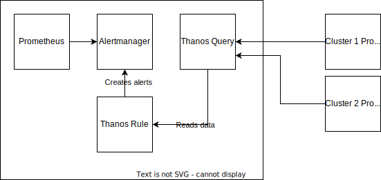

Metrics and monitoring are essential for ensuring the health and performance of Go applications. Metrics are data points
that represent the state of an application, such as CPU usage, memory usage, and requests per minute. Monitoring is the
process of collecting, storing, and analyzing metrics to identify problems and trends. By monitoring their applications,
developers can proactively identify and fix problems before they impact users.

The D2iQ Kubernetes Platform (DKP) comes with monitoring stack components consisting of [Prometheus][], which collects
metrics, [Grafana][], which can visualize and present the metrics, [Alertmanager][], which handles acting on metrics and
sending alerts to 3rd party services, and [Thanos][] which handles multi-cluster functionality of [Prometheus][]. These
components are configured to provide monitoring and alerting for applications launched on DKP.

## How to emit metrics from Go applications

To emit metrics from a Go application, use the [Prometheus library][], which provides a number
of helpful functions. There are multiple types of metrics that applications can emit.
The type of metrics defines how the Prometheus will interpret the data.

Prometheus has four types of metrics:

* *Counters*: Counters are metrics that can only increase or reset to zero. They are typically used to track things like
  the number of requests, the number of errors, and the number of bytes transferred.
* *Gauges*: Gauges are metrics that can go up and down. They are typically used to track things like the current memory
  usage, the current CPU usage, and the number of concurrent connections.
* *Histograms*: Histograms are used to track the distribution of values. They are typically used to track things like the
  response time of requests, the size of requests, and the number of errors.
* *Summaries*: Summaries are similar to histograms, but they also track the quantiles of the distribution. This can be
  useful for identifying outliers and understanding the tail of the distribution.

An example Go application that would expose an `/increment` HTTP handler that would increase a counter metric would look
like this:

```go
package main

import (
    "github.com/prometheus/client_golang/prometheus"
    "github.com/prometheus/client_golang/prometheus/promhttp"
)

func main() {
    // Create a counter metric.
    requests := prometheus.NewCounter(
        prometheus.CounterOpts{
            Name: "my_app_requests_total",
            Help: "The total number of requests.",
        },
    )
    // Register the counter with Prometheus.
    prometheus.MustRegister(requests)

    http.Handle("/increment", func(w http.ResponseWriter, req *http.Request) {
        requests.Inc()
        fmt.Fprintf(w, "OK")
    })
    http.Handle("/metrics", promhttp.Handler())
    http.ListenAndServe(":8090", nil)
}
```

For more details see the [prometheus tutorial](https://prometheus.io/docs/tutorials/instrumenting_http_server_in_go/) on
how to integrate the prometheus library and emit metrics.

## How to integrate metrics with DKP

Prometheus uses a pull model to collect metrics. This means that Prometheus actively fetches metrics from the targets,
rather than the targets pushing metrics to Prometheus. In the example above the prometheus handler only creates an HTTP
handler on the `/metrics` path but it is not actively pushing collected metrics anywhere.

When an application runs on Kubernetes cluster in a Pod it is usually exposed via `Service` resource that can expose
Pods networking ports to the rest of the cluster. The Prometheus operator that comes with DKP exposes a custom resource types
CRD `ServiceMonitor` and `PodMonitor` that should be used to configure prometheus instance to include a particular
Kubernetes service into scraping targets from which prometheus will read the metrics data.

When creating own `ServiceMonitor` it is necessary to include the `prometheus.kommander.d2iq.io/select: "true"` label on
the resource. Based on this label the default instance of Prometheus installed on DKP will include the `ServiceMonitor`
configuration. The Prometheus operator allows to run multiple Prometheus instances and the label selector is used to
associate service monitors with a Prometheus instance.

In the example below the `ServiceMonitor` instructs the DKP Prometheus to scrape data from the `Service` that matches the
label `app: my-go-app` on port `http` and the `/metrics` path.

```yaml
apiVersion: monitoring.coreos.com/v1
kind: ServiceMonitor
metadata:
  name: my-go-app-monitor
  namespace: my-namespace
  labels:
    prometheus.kommander.d2iq.io/select: "true"
spec:
  selector:
    matchLabels:
      app: my-go-app
  endpoints:
    - port: http
      interval: 1s
      path: /metrics
      scheme: http
```

To confirm that metrics are scraped by Prometheus visit `https://<CLUSTER_DOMAIN>/dkp/prometheus/graph` and enter
`my_app_requests_total` in the console to see the metrics.

## Alerting

Alerting is the process of notifying users when a metric or set of metrics exceeds a predefined threshold. This can be
used to proactively identify problems before they impact users. DKP comes with an [Alertmanager][] installation that can be
used to receive alerts from Prometheus and send them to a variety of notification channels, such as email, Slack, or
PagerDuty. Alertmanager itself is not creating any alerts, but rather only propagates and routes information based on
routing rules. Alerts are created by Prometheus by continuously evaluating metrics values and creating alerts by calling
the Alertmanager API.

To create an alert definition, use the `PrometheusRule` resource:

```yaml
apiVersion: monitoring.coreos.com/v1
kind: PrometheusRule
metadata:
  name: my-app-example-rule
  namespace: my-namespace
  labels:
    prometheus.kommander.d2iq.io/select: "true"
spec:
  groups:
  - name: my-app
    rules:
    - alert: MyAppExampleRule
      annotations:
        description: ""
        summary: Number of requests is over a threshold
      expr: |-
        my_app_requests_total > 5
      for: 1m
      labels:
        severity: critical
```

The Prometheus operator will apply this configuration to the default Prometheus instance, which is configured to push alerts to
Alertmanager. When the number of requests goes over 5, Prometheus will create a new alert by calling the Alertmanager
HTTP API. The `PrometheusRule` can be created on DKP management or attached clusters.

## Multi-cluster monitoring and alerting

The DKP metrics stack is configured by default to collect metrics across all managed clusters and have them available in
the central management DKP cluster. For that purpose, DKP comes with Thanos which is a tool that can be used to extend
Prometheus's capabilities for collecting and storing metrics across multiple clusters. Thanos Query component can be
used to query metrics from multiple Prometheus servers in a single place. This makes it possible to view and analyze
metrics from all of the clusters in a single place.

To make alerting possible on metrics from all clusters, it is necessary to enable Thanos Ruler component. Thanos Ruler is
a component of Thanos that can be used to evaluate Prometheus recording and alerting rules against a chosen query API,
and then send the results directly to remote storage. It can be used to make alerting possible across multiple clusters
by evaluating rules against a central query API that aggregates data from all of the clusters.

To enable Ruler on the DKP management cluster, add the following configmap:

```yaml
apiVersion: v1
kind: ConfigMap
metadata:
  name: kube-prometheus-stack-overrides
  namespace: kommander
data:
  values.yaml: |
    thanosRuler:
      enabled: true
      thanosRulerSpec:
        queryEndpoints:
          - http://thanos-query.kommander:10902/
        alertmanagersUrl:
          - http://kube-prometheus-stack-alertmanager.kommander:9093
        ruleSelector:
          matchLabels:
            role: thanos-alerts
        routePrefix: /dkp/ruler
        externalPrefix: /dkp/ruler
      ingress:
        enabled: true
        paths:
          - /dkp/ruler
        annotations:
          traefik.ingress.kubernetes.io/router.middlewares: "kommander-forwardauth@kubernetescrd"
          traefik.ingress.kubernetes.io/router.tls: "true"
```

And apply the override to the `kube-prometheus-stack` `AppDeployment`.

```sh
cat <<<EOF | kubectl patch --type merge -n kommander appdeployments kube-prometheus-stack --patch-file=/dev/stdin
spec:
  configOverrides:
    name: kube-prometheus-stack-overrides
EOF
```

The configuration above will deploy the Thanos Ruler on the DKP management cluster, it will expose its UI on the
`https://<CLUSTER_DOMAIN>/dkp/ruler` URL, and it will limit the rules only with `role: thanos-alerts` to be used by
Ruler. The Ruler is configured the same way as Prometheus using the `PrometheusRule` resource. Limiting the configuration to
the specific label allows to select which configuration will be applied to the Prometheus and which will be applied to
the Thanos Ruler. The exact same `PrometheusRule` resources can now create alerts for data coming from multiple
clusters.

The final result looks like this.



## Conclusion

Multi-cluster monitoring is an important feature of the DKP platform because it allows you to monitor multiple Kubernetes
clusters from a single pane of glass. This can help you to identify and troubleshoot problems that affect multiple
clusters, and to plan for the capacity needs of your clusters. DKP gives administrators flexibility to define and deploy
various monitoring and alerting configurations per cluster or in a single centralized location.

[Prometheus]: https://prometheus.io
[Grafana]: https://grafana.com/grafana/
[Alertmanager]: https://prometheus.io/docs/alerting/latest/alertmanager/
[Thanos]: https://thanos.io
[Prometheus library]: https://pkg.go.dev/github.com/prometheus/client_golang
