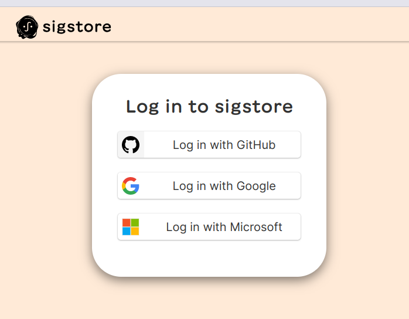
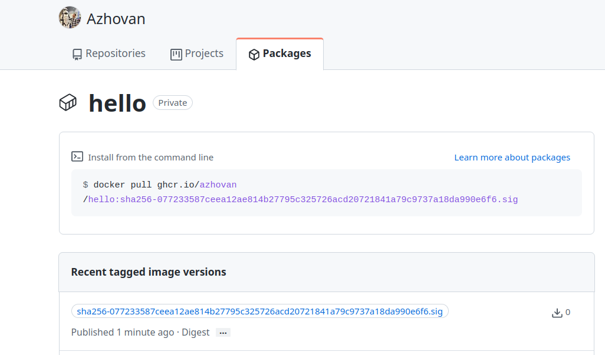
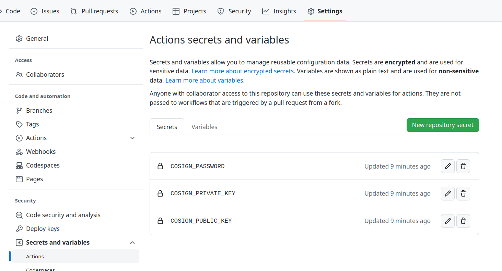

# Software Digital Signature

In this article, we explore signing artifacts such as containers, local files or OCI registry binaries etc., and we see how your artifacts can be signed in Github actions and Kubernetes.

## Introduction

Cosign is one slice of the bigger umbrella [Sigstore, an ecosystem](https://www.sigstore.dev/) under the [openSSF](https://openssf.org/) community, aiming to improve software's security supply chain. Its approach is pretty unique, simple yet powerful. In fact simplicity is one of the Sigstore fundamentals. It is designed with transparency in mind, that is, its been accepted very quickly by the community in a very short period of time i.e [Kubernetes](https://kubernetes.io/blog/2022/05/03/kubernetes-1-24-release-announcement/#signing-release-artifacts), [Arch linux](https://archlinux.org/packages/community/x86_64/cosign/), [Github](https://github.com/marketplace/actions/cosign-installer). A few months ago it got its very first GA, and, with a stable API, now companies can consider it in production and benefit from Cosign.

## What problem does it solve?

Software widely consists of distributed artifacts, which are updated quite frequently. Companies and developers that build on top of these artifacts might expose their users to threats and vulnerabilities. This is where the [digital signature](https://en.wikipedia.org/wiki/Digital_signature) comes into the picture. By definition, this is a scheme to help users verify the legitimacy of the downloaded software.

Two major topics when digitally signing software artifacts are **integrity** and **authenticity**, respectfully ensuring that signed data has not been altered and originates from the signer. While these are quite important, this does not guarantee the software delivered to the end user is still legitimate. We see why this is the case.

## Digital software signature scheme

A software digital signature's scheme consists of the following mechanisms:

- **Key creation** : a way to **generate** public/private key pairs
- **Sign** : an algorithm to attach a signature to the software
- **Verification** : a way to verify the signature with help of the public key.

Some commonly used schemes are ECDSA, RSA, etc.

In the simplest way, a private key is used/generated by the owner (company or developer) to sign the artifacts and hopefully remains safe and secret!. On the other hand, A public key as the name implies is something publicly available(also generated by the owner).

There are three main challenges when using public/private key pairs to sign software artifacts: 

- Distributions
- Storage
- Key Revocation

Storing private keys somewhere safe is a big challenge, even for big companies that are prone to make mistakes. When a private key is compromised, re-distributing a new key to the users is a big deal of challenge.

##  Why is Sigstore different?

Instead of keys, Sigstore relies on identity. It is important because owner identity remains the same, regardless of whether its private key has been compromised. This immediately removes the necessity of public key discovery and distribution.

Sigstore has its own OIDC identity provider which is based on [Dex](https://github.com/dexidp/dex) and supports email-based OIDC providers Google, Github and Microsoft.

Sigstore has a built in transparency logs service that records signed metadata to a ledger. Users can query the ledger and find useful information about the software they use. We explore this in detail in following sections.

##  How does Cosign work?

There are two ways to use the Cosign signing mechanism. The recommended approach is what is called [keyless signing](https://docs.sigstore.dev/cosign/keyless/#overview).

In a nutshell a **short-lived** certificate is generated and a transparency log is created in the [Rekor](https://rekor.sigstore.dev/) server.

Here are the steps that Cosign take in details when you want to sign a new artifact:

**Signing Artifact**
- Step 1): Cosign sends the user into an OIDC login flow and, if authentication is successful, an OIDC ID token is returned.
- Step 2): Cosign generates a private key in [memory](https://github.com/sigstore/cosign/blob/a8f57b66e8ad96ba13541dadc3bd47ae0c9a0c67/cmd/cosign/cli/sign/sign.go#L543).
- Step 3): Cosign sends a request to [Fulcio](https://docs.sigstore.dev/fulcio/overview/), the Sigstore certificate authority, with the user's public key and token\_id from the previous step.
- Step 4): Fulcio returns a short-lived code signing certificate containing the user's identity metadata (e.g. email) and public key to Cosign that is [valid for 10 minutes](https://github.com/sigstore/fulcio/blob/d54330c45f9c271fdf5b9d7eebe08284a700387f/pkg/ca/common.go#L43). 
- Step 5): Cosign signs the artifact and generates a signature.
- Step 6): Cosign adds a new record to [Rekor](https://docs.sigstore.dev/rekor/overview/), the Sigstore transparency log, with the signature and certificate from previous steps.
- Step 7): Rekor returns back a bundle timestamped and signed with its public key, which contains the user public key and signature to the Cosign.
Note that when you sign an artifact like a container, this information is attached to the artifact by Cosign. 

**Verification Signature**
I mentioned that the certificate generated by Cosign is only valid for 10 minutes. You may be wondering how this very likely expired certificate can be used by the users to verify artifacts.
The verification process is different from normal certification validation, for example TLS verification that you are likely more familiar with.
What matters in the verification process is:
- Verify that Rekor signed the artifact with a specific timestamp for a specific identity.
- Verify that the signature is valid, using the artifact and the user's public key. 

The **second** option is the classic way, you can still use the private key to sign your software by providing it during the signing, and then use your public key to verify it. We will see these in action in next sections.

##  What does Sigstore sign?

A wide range of software artifacts, OCI compliant artifacts, Git tags, Blobs, Tekton bundles, WASM, and so on, for more details on this check the [documentation](https://docs.sigstore.dev/).

##  Examples

- [Signing container image](#signing-a-container-image)
- [Signing OCI binary file](#signing-oci-registry-binaries)
- [Signing local binary](#signing-local-binaries)
- [Github actions integration](#github-integrations)
- [Github Integration](#github-actions-integration)
- [Kubernetes integration](#kubernetes-integration)

## Signing a container image:

In this section we create a container, sign it, and then verify its signature by using Cosign.

To keep our example close to a real world scenario, we publish our signed container image into the github OCI registry. We also see how to sign container images using **github actions.**

In this demo we use [docker](https://docs.docker.com/get-docker/) to create the container, so make sure you have it installed.

To install cosign you can also follow the steps in [official documentation](https://docs.sigstore.dev/cosign/installation/)based on your environment.

**Prerequisites**

To publish our container into the Github container registry, we need to first authenticate against the Github Container registry. To do so you'll need an access token. You can use a personal access token (classic) or in short **PAT** to do the authentication. Each access token has a scope that is a list of permissions that you'll grant it. We need following permissions:

- read:packages
- write:packages
- delete:packages

To create personal access token follow [Github documentation](https://docs.github.com/en/authentication/keeping-your-account-and-data-secure/creating-a-personal-access-token). When you generated one, save it in an environment variable:

```bash
export PAT=Your_Token
```

Go ahead and sign in to the Container registry by running the following command (USERNAME is your username in github):

```bash
echo $PAT | docker login ghcr.io -u USERNAME --password-stdin

> Login Succeeded
```

It is important to note that the container registry service is at **ghcr.io**; we use this host later when we tag and publish our container.

Step1: Creating the container

Create a new directory called hello, and put our Dockerfile there. I use Ubuntu as my operating system so I will create this directory in the `/tmp` directory.

```bash 
cd /tmp 
mkdir hello && cd hello 
```

Now lets create the Dockerfile, it is fairly simple and enough for our demonstration too. Go ahead and use your editor of choice! (I use vim)
```bash
vim Dockerfile 
```

Copy and paste the following commands into the Dockerfile:

```bash
FROM alpine
CMD ["echo", "Hello!"]
```

Step2: Building the container

To build the container in the same directory that Dockerfile exist, run following command
```bash
docker build -t hello .
```

Step3: Tagging the container

Find the ID for the hello image that we just built by running following command in your terminal:

```bash
$ docker images

REPOSITORY  TAG   	   IMAGE ID   	    CREATED     	   SIZE
hello       latest         95ecc945e8c8     1 minutes ago          7.05MB

```

it is important to note how content is organized within the Github container registry. Content is stored in the **ghcr.io/\<NAMESPACE\>/\<ARTIFACT\>** format. **NAMESPACE** , in this situation, represents the name of a user account or GitHub organization. I am using my personal github user so command is like the following:

```bash 
docker tag 95ecc945e8c8 ghcr.io/azhovan/hello:latest
```

Step3: Publishing the container
```bash 
docker push ghcr.io/azhovan/hello:latest
```

When you publish a package for the first time, the default visibility is private. We don't need to change the default for this demo.

Step4: Signing the container

Now that the container is in the Github container registry we are ready to sign our very container, and push that signature to the registry

```bash 
cosign sign ghcr.io/azhovan/hello:latest 
```

You are asked to accept that you agree with having your information in the transparency log. 
```shell
Generating ephemeral keys...
Retrieving signed certificate...

    	Note that there may be personally identifiable information associated with this signed artifact.
    	This may include the email address associated with the account with which you authenticate.
    	This information will be used for signing this artifact and will be stored in public transparency logs and cannot be removed later.

By typing 'y', you attest that you grant (or have permission to grant) and agree to have this information stored permanently in transparency logs.
Are you sure you would like to continue? [y/N]
```
Type `y` and you will be navigated to the OIDC workflow we mentioned earlier. Sign in to sigstore using you github account.



Since I am signing a private package I am asked by cosign again. It is fine and type **y**

```shell 
WARNING: "ghcr.io/azhovan/hello" appears to be a private repository, please confirm uploading to the transparency log at "https://rekor.sigstore.dev"
Are you sure you would like to continue? [y/N]
```

Now we should be able to see that an SHA has been added to the tag.



Step5: Verifying the container's signature

At this step we can verify that our newly created container is signed by us. Also it is important to note that this approach can be applied to any signed container using the same steps.
```bash 
cosign verify \                     
--certificate-identity jasadi@d2iq.com \
--certificate-oidc-issuer https://github.com/login/oauth \
ghcr.io/azhovan/hello
```

Outputs include important information about the image digest, owner, OIDC issuer etc.

```shell
Verification for ghcr.io/azhovan/hello:latest --
The following checks were performed on each of these signatures:
 - The cosign claims were validated
 - Existence of the claims in the transparency log was verified offline
 - The code-signing certificate was verified using trusted certificate authority certificates
 
[
  {
	"critical": {
  	"identity": {
    	"docker-reference": "ghcr.io/azhovan/hello"
  	},
  	"image": {
    	"docker-manifest-digest": "sha256:077233587ceea12ae814b27795c325726acd20721841a79c9737a18da990e6f6"
  	},
  	"type": "cosign container image signature"
	},
	"optional": {
  	"1.3.6.1.4.1.57264.1.1": "https://github.com/login/oauth",
  	"Bundle": {
    	"SignedEntryTimestamp": "MEUCIDuVKZpr7kFCKo0emHYNG5upq7XJgZu4UOQtiqCkeJBzAiEAjumrKdDDLvU6Nbp20JHd2W/ELeUjQqslDsaEEAnHgcU=",
    	"Payload": {
      	"body": "eyJhcGlWZXJzaW9uIjoiMC4...",
      	"integratedTime": 1679382042,
      	"logIndex": 15932677,
      	"logID": "c0d23d6ad406973f9559f3ba2d1ca01f84147d8ffc5b8445c224f98b9591801d"
    	}
  	},
  	"Issuer": "https://github.com/login/oauth",
  	"Subject": "jasadi@d2iq.com"
	}
  }
]

```

## Signing Binaries

You can sign and verify standard files and blobs in the OCI registry or local machine using Cosign. Signing a binary in a OCI registry is very similar to signing a container image.

## Signing OCI registry Binaries

Let's create an example binary from a simple golang file:
```bash 
$ cat <<EOF > main.go  
package main

import "fmt"

func main() {
fmt.Println("this is test ")
}
EOF
```
Build the golang file: 
```bash
go build main.go
```
Upload the build file to GitHub container registry
```bash
cosign upload blob -f main ghcr.io/<owner>/<artifact-name>

# for me it will be: 
# cosign upload blob -f main ghcr.io/azhovan/main
```

Signing the file in OCI registry using keyless approach: 
```bash 
cosign sign ghcr.io/<owner>/<artifact-name>

# for me it will be: 
# cosign sign ghcr.io/azhovan/main
```


## Signing local Binaries

If you don't have files in your OCI registry but instead have them on your local machine, you can no longer use keyless signing, but can use private/public key pairs.

```bash 
cosign generate-key-pair
```

This generates `cosign.key` that is your private key and `cosign.pub` that is your public key.
```bash 
Enter password for private key:  
Enter password for private key again:  
Are you sure you would like to continue? [y/N] y
Private key written to cosign.key
Public key written to cosign.pub
```

Lets now, create a local file with custom content and sign it 
```bash 
echo "D2IQ Kubernetes Platform"" > d2iq.txt

cosign sign-blob d2iq.txt --key cosign.key

```
follow the prompt and type `y` to sign the file.
```shell
Using payload from: d2iq.txt
Enter password for private key:  

       Note that there may be personally identifiable information associated with this signed artifact.
       This may include the email address associated with the account with which you authenticate.
       This information will be used for signing this artifact and will be stored in public transparency logs and cannot be removed later.

By typing 'y', you attest that you grant (or have permission to grant) and agree to have this information stored permanently in transparency logs.
Are you sure you would like to continue? [y/N] y
tlog entry created with index: 16056076
MEUCIEaTpRK/nsBLGvxg1aYy9hHp4CCHj2rnkUOY3wdPbe7fAiEAw2nZHX9b3kFu13L5fd3rvgk0cozHl5JpJ7+NpxbfylM=
```
Notice that `MEUCIEaTpRK/nsBLGvxg1aYy9hHp4CCHj2rnkUOY3wdPbe7fAiEAw2nZHX9b3kFu13L5fd3rvgk0cozHl5JpJ7+NpxbfylM=` is the signature content that is required for verification.

To verifying the signature, use public key with the do as follows:
```shell 
cosign verify-blob --key cosign.pub main --signature=MEUCIEaTpRK/nsBLGvxg1aYy9hHp4CCHj2rnkUOY3wdPbe7fAiEAw2nZHX9b3kFu13L5fd3rvgk0cozHl5JpJ7+NpxbfylM=
```

## Github Integrations

You can generate public/private key pairs and store them directly on GitHub actions's secret. The benefit of this is to save these keys directly into your Github settings without being copied into your browser, terminal, or disk.
```bash
cosign generate-key-pair github://<owner>/<project>
```

This creates three action secrets `COSIGN_PASSWORD`, `COSIGN_PRIVATE_KEY`, `COSIGN_PUBLIC_KEY`



## Github actions Integration

Generate private/public key pair for your project and save them into your actions like what mentioned above in [Github Integrations](#github-integrations)
```bash
cosign generate-key-pair github://<owner>/<project>
```

Create new workflow or add a new step to your existing one like the following:

```yaml
jobs:
  build:
  steps:
      ..
        - uses: sigstore/cosign-installer@main
        …
        …
        - name: Write signing key to disk (only needed for `cosign sign --key`)
            run: echo "${{ secrets.COSIGN_PRIVATE_KEY }}" > cosign.key
                   …

                   …
        - name: Sign container image
          run: |
            cosign sign --key cosign.key \
                -a "workflow=${{ github.workflow }}" \ # <- this is an annotation 
             	-a "repo=${{ github.repository }}" \   # <- this is an annotation 
             	ghcr.io/your-org/your-repo:some-tag
          env:
            COSIGN_PASSWORD: ${{ secrets.COSIGN_PASSWORD }}
```
That's it!

## Kubernetes integration
Cosign can use keys stored in Kubernetes Secrets to sign/verify signatures using following command:

```bash 
cosign generate-key-pair k8s://[Namespace]/[Secret-Name]
```
Generated key pairs are stored in the Kubernetes secret using your current context as follow: 
```yaml
    apiVersion: v1
    data:
      cosign.key: LS0tLS1CRUdJTiBFTkNSWVBURUQgQ09TS...
      cosign.password: ""
      cosign.pub: LS0tLS1CRUdJTiBQVUJMSUMgS0VZLS0tL...
    immutable: true
    kind: Secret
    metadata:
      creationTimestamp: "2023-03-22T21:02:04Z"
      name: testsecret
      namespace: default
      resourceVersion: "757"
      uid: e6bed17e-7c96-49d8-8b14-1d40c8a65cce
    type: Opaque
```
